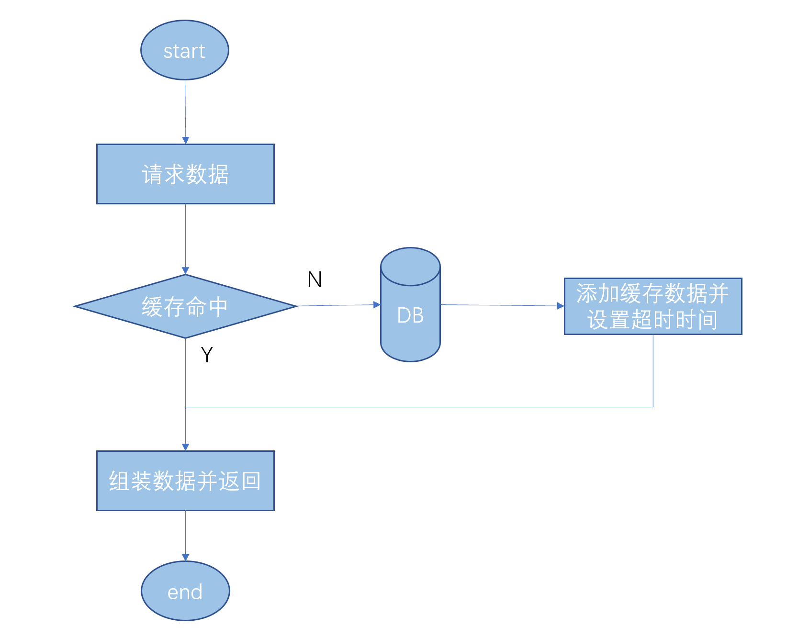
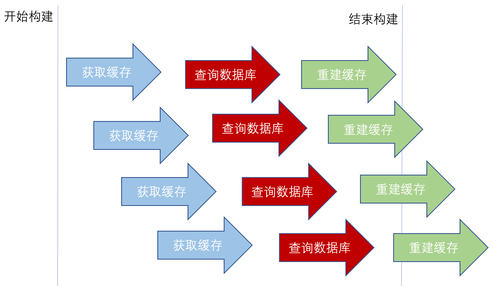

# Cache
---
## 一 为什么要使用缓存
DB操作是服务的性能瓶颈。数据库的数据是存储在磁盘上的，在进行数据库查询的时候需要读磁盘上的数据，优化数据库查询时，通常使用索引，索引是基于B+树结构实现的，相比于全表扫描它可以根据索引树的层级结构减少磁盘IO次数，但是还是不能避免磁盘IO。而缓存往往是基于内存的，要比DB读数据快两个数量级，这是我们用缓存的根本原因。
###常用方案（Cache - DB）

## 二 常用方案可能会出现的缓存问题
### 2.1 缓存穿透
#### 2.1.1 什么是缓存穿透
    public Account getAccount(String erp, boolean refreshCache) {
        Account account = null;
        String cacheKey = CacheKeys.CACHE_PREFIX_PORTAL_ACCOUNT + erp;
        if (refreshCache) {
            this.cacheService.evict(cacheKey);
        } else{
            account = this.cacheService.get(cacheKey);
        }
        if (null != account) {
            return account;
        }
        // 查询数据库获取账号信息
        account =  this.permissionService.getMenuResourceByUserNo(SYSTEM_PORTAL, erp); 
        this.cacheService.put(cacheKey, account, CacheConsts.TIMEOUT_HALF_AN_HOUR);
        return account;
    }
    
如上代码，按照cacheKey 去缓存查询，如果不存在cacheKey 再去查询数据库。但是如果以一个不存在并发量很大的cacheKey 查询，那么每次都会访问数据库，给后端服务造成很大压力，这种情况就是缓存穿透。
#### 2.1.2 解决方案
（1）对不合规的数据进行校验 
（2）对空结果进行缓存处理

### 2.2 缓存击穿
#### 2.2.1 什么是缓存击穿

使用缓存通常会设置实效，那么当缓存失效的时间点开始到重建缓存结束的时间范围内，如果重建缓存的时间很长且请求量很高，那么在这个时间范围内是有可能造成缓存击穿。
#### 2.2.2 解决方案
缓存击穿的解决方案是避免在重建缓存过程中的大量并发访问，以加分布式锁的方式避免，会在后文 （六 分布式Cache锁）详细介绍

### 2.3 缓存雪崩
#### 2.3.1 什么是缓存雪崩
缓存雪崩是指比如我们给所有的数据设置了同样的过期时间，然后在某一个历史性时刻，整个缓存的数据全部过期了，然后瞬间所有的请求都被打到了数据库，数据库就崩了。
#### 2.3.2 解决方案
（1）分治，划分更小的缓存区间，按区间过期 
（2）给每个key的过期时间加个随机值，避免同时过期，达到错峰刷新缓存的目的