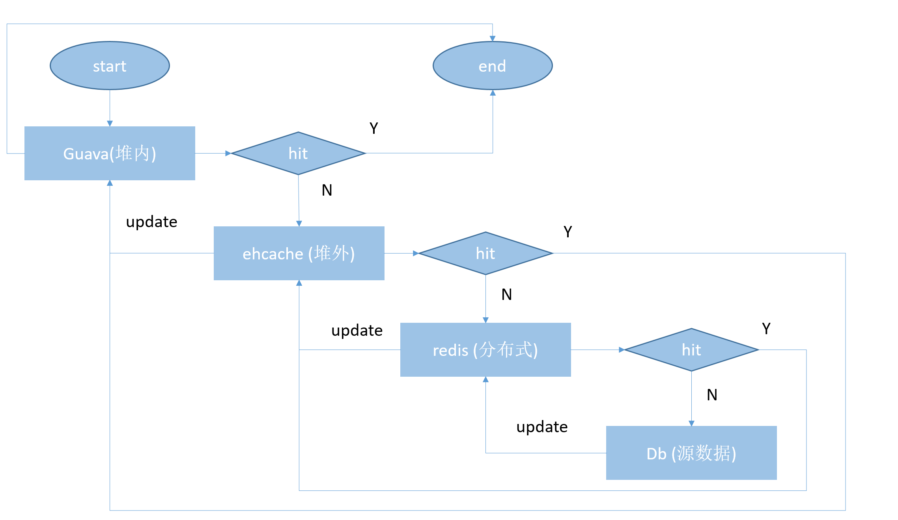

# 缓存实战
---
## 一 热key
通常使用 缓存 + 过期时间的策略来帮助我们加速接口的访问速度，减少了后端负载，同时保证功能的更新，一般情况下这种模式已经基本满足要求了。但是无法避免热key的问题
### 1.1 热key失效 
由于一些突发的的事件，导致某新闻点击量瞬间变大，请求远超过对数据的写入。就会造成热数据问题。热点key缓存失效瞬间可能造成[缓存击穿](/markdown/cache/cache.md)问题 
### 1.2 解决方案
#### 1.2.1 使用互斥锁
在上图查询数据库的过程，只让一个线程独占，这个线程构建缓存的过程，其他线程都要等待，直到第一个线程构建完成可以从中读取数据
#### 1.2.2 提前使用互斥锁
提前使用互斥锁，和互斥锁差不多，都是让一个线程独占构建缓存，不一样的是，在构建缓存的时候。在value内部设置一个超时值timeout1，这个过期时间比实际的缓存过期时间短。
当从缓存中读到timeout1已经过期的时候，就认为数据也快过期了，直接执行查询数据库，进行构建缓存的过程。这样在所有快过期的数据前，就重新构建了缓存
#### 1.2.3 使用本地缓存
热key问题需要对重建缓存过程进行限制，避免多个线程同时重建缓存。使用本地缓存[guava的阻塞加载机制](/markdown/cache/guava.md) 可以避免热key问题

## 二 秒杀
### 2.1 基于redis的list
基于队列的方案利用了redis出队操作的原子性，抢购开始之前首先将商品编号放入响应的队列中，在抢购时依次从队列中弹出操作，这样可以保证每个商品只能被一个进程获取并操作，不存在超发的情况。该方案的优点是理解和实现起来都比较简单，缺点是当商品数量较多是，需要将大量的数据存入到队列中，并且不同的商品需要存入到不同的消息队列中
### 2.2 基于redis的decr
如果我们将剩余量num设置为一个键值类型，每次先get之后判断，然后再decr是不能解决超发问题的。但是redis中的decr操作会返回执行后的结果，可以解决超发问题。我们首先get到num的值进行第一步判断，避免每次都去更新num的值，然后再对num执行decr操作，并判断decr的返回值，如果返回值不小于0，这说明decr之前是大于0的，用户抢购成功
### 2.3 基于setnx的排它锁方案
edis没有像mysql中的排它锁，但是可以通过一些方式实现排它锁的功能，
setnx实现了exists和set两个指令的功能，若给定的key已存在，则setnx不做任何动作，返回0；若key不存在，则执行类似set的操作，返回1。我们设置一个超时时间timeout，每隔一定时间尝试setnx操作，如果设置成功就是获得了相应的锁，执行num的decr操作，操作完成删除相应的key，模拟释放锁的操作。

## 三 分布式缓存锁

## 四 缓存的事物

## 五 三级缓存模型
