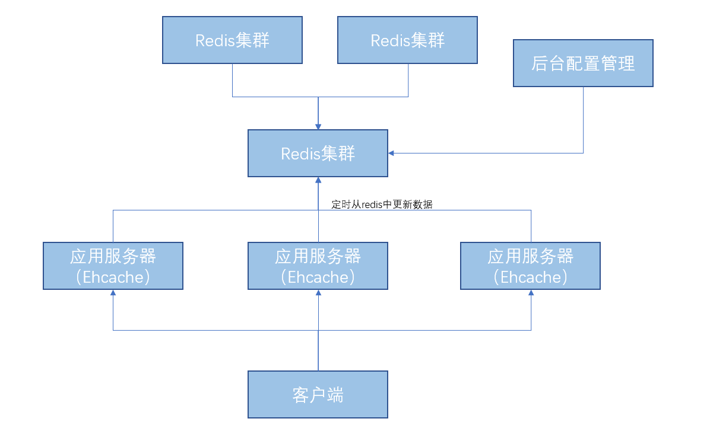
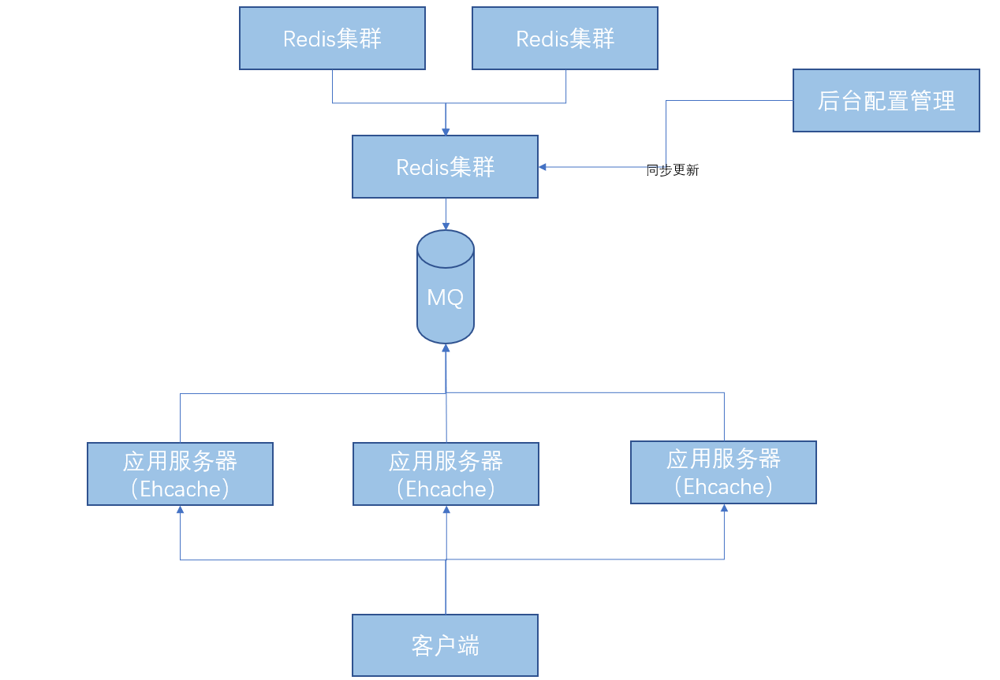

# ehcache
---
## 一 ehcache 优点
### 1.1 快速 简单
由于ehcache是最快的Java缓存之一，ehcache的线程机制是为大型高并发系统设计，很多用户都不知道自己在使用ehcache,可以看出其配置也很简单，api也易于使用。
### 1.2 多种缓存策略
Ehcache 提供LRU、LFU、FIFO淘汰算法
### 1.3 二级缓存
内存和磁盘二级缓存，在单台虚拟机上可以支持多缓存管理器
### 1.4 重启落盘
缓存数据会在虚拟机重启过程中写入磁盘
### 1.5 分布式缓存
可以通过RMI、可插入API等方式进行缓存
### 1.6 提供缓存和缓存管理器的侦听接口
允许注册实现了 CacheManagerEventListener 接口的监听器，方法分别是 notifyCacheAdded() 和 notifyCacheRemoved() 
允许注册实现了 CacheEventListener 接口的监听器，它提供了许 多对缓存事件发生后的处理机制， notifyElementRemoved/Put/Updated/Expired
### 1.7 提供Hibernate的缓存实现
hibernate默认二级缓存是不开启的，启动二级缓存通过采用Ehcache实现

## 二 ehcache使用
### 2.1 xml配置
    <?xml version="1.0" encoding="UTF-8"?> <ehcache xmlns:xsi="http://www.w3.org/2001/XMLSchema-instance" xsi:noNamespaceSchemaLocation="http://ehcache.org/ehcache.xsd">
    <!-- 磁盘缓存位置 -->
    <diskStore path="/tmpdir/ehcache"/>
    <!-- 默认缓存 -->
    <defaultCache
            maxEntriesLocalHeap="10000"
            eternal="false"
            timeToIdleSeconds="120"
            timeToLiveSeconds="120"
            maxEntriesLocalDisk="10000000"
            diskExpiryThreadIntervalSeconds="120"
            memoryStoreEvictionPolicy="LRU">
        <persistence strategy="localTempSwap"/>
    </defaultCache>
    <cache name="ehCache"
           maxElementsInMemory="1000"
           eternal="false"
           timeToIdleSeconds="5"
           timeToLiveSeconds="5"
           overflowToDisk="false"
           memoryStoreEvictionPolicy="LRU"/>
    </ehcache>
    
### 2.2 调用  
    CacheManager cacheManager = CacheManager.create("./src/main/resources/ehcache.xml");
    Cache cache = cacheManager.getCache("ehCache");
    Rectangle rectangle = new Rectangle(12, 13);
    Element element = new Element("rectangle", rectangle);
    cache.put(element);
    Element elementValue = cache.get("rectangle");
    Rectangle ehcacheRectangle = (Rectangle) elementValue.getObjectValue();
    cache.flush();
    cacheManager.shutdown()
    
## 三 ehcache适用场景
 
### 3.1 比较少更新数据表的情况
 ehcache作为hibernate的缓存时，在数据精心修改表数据(save/update/delete)会自动把缓存中与此表相关的缓存全不删除
### 3.2 对并发要求不是很严格的情况
 多台服务器中的缓存不能实时同步
### 3.1 对一致性要求不是很高的情况
 由于ehcache本地缓存的特性，目前无法很好解决不同服务器之间缓存同步的问题
## 四 Ehcache的瓶颈

### 4.1 缓存漂移
每个应用结点只管理自己的缓存，在更新某个节点的时候，不会影响到其他服务器的节点，这样就造成数据不同步了
### 4.2 数据库瓶颈
对于单点实例应用来说，缓存可以保户数据库的读风暴，但是由于数据同步方式问题在集群环境下，节点越多会导致同步数据的开销越大

## 五 使用方案
### 5.1 常用缓存方案

如果在项目中使用分布式集中缓存如果缓存，缓存系统因为某些原因宕机，那么大量的请求会直接穿透到数据库，对数据库造成巨大压力
### 5.2 解决方案-定时轮询

缺点轮训时间点可能不一致，会产生数据不一致的问题
### 5.3 解决方案-主动通知
