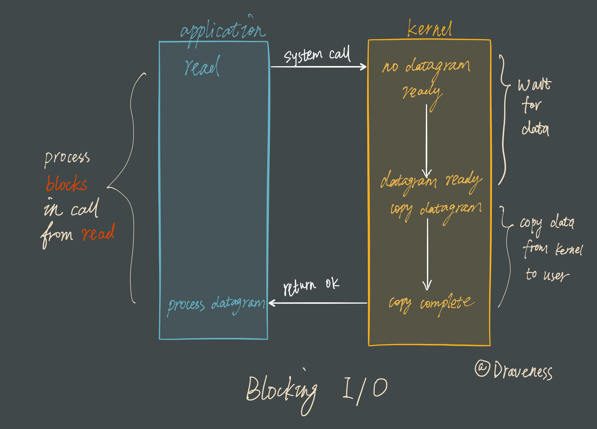
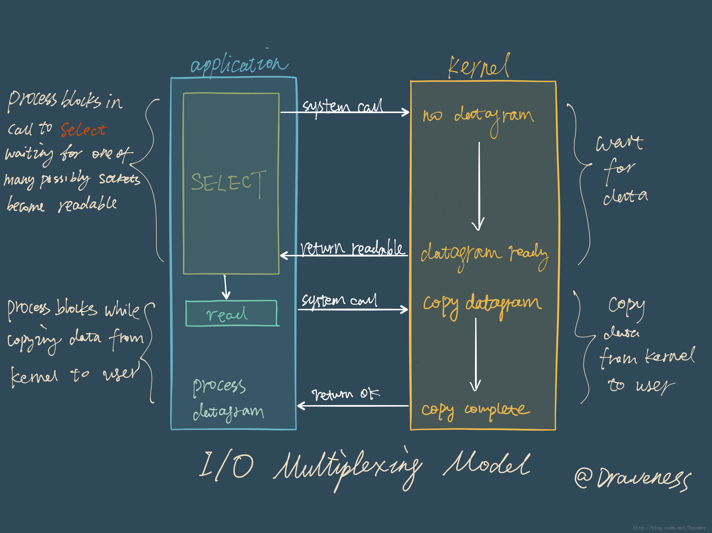
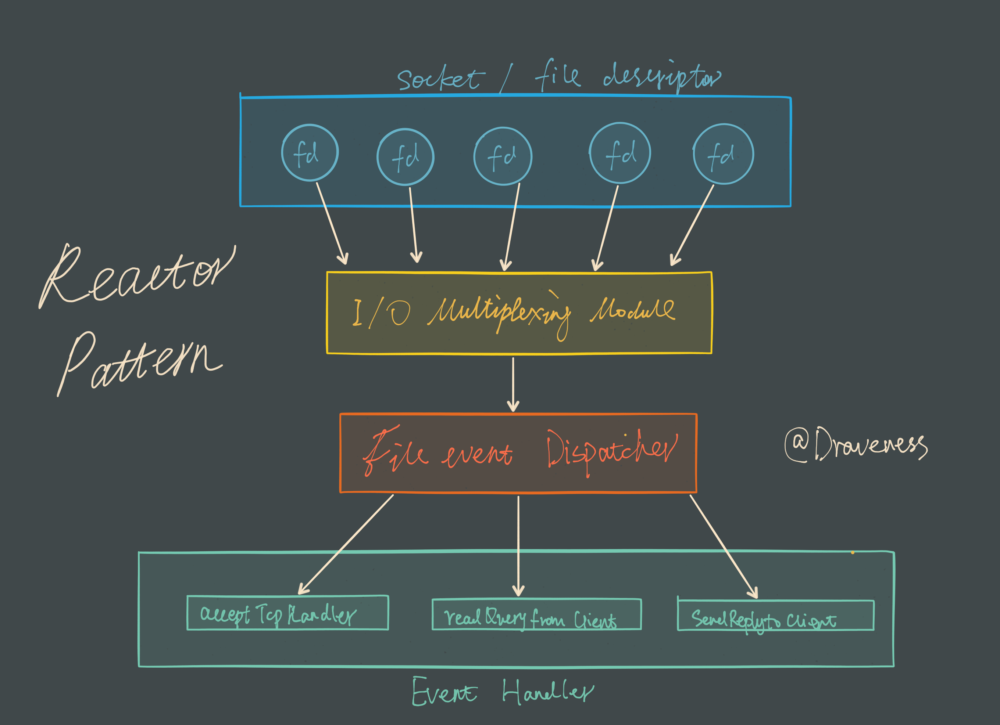
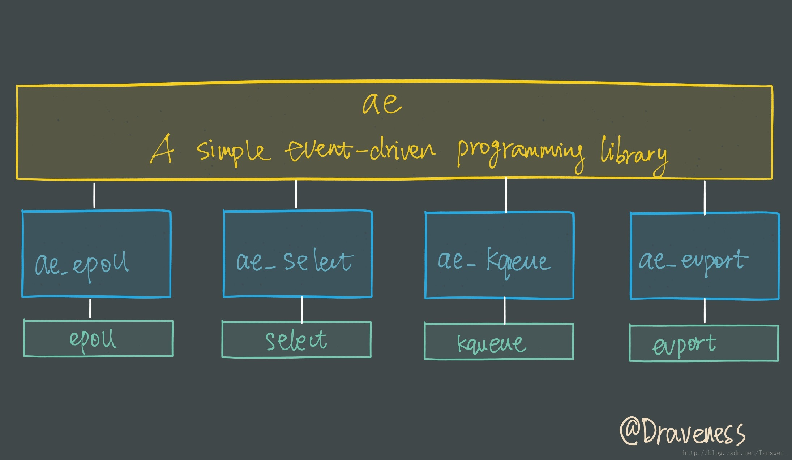
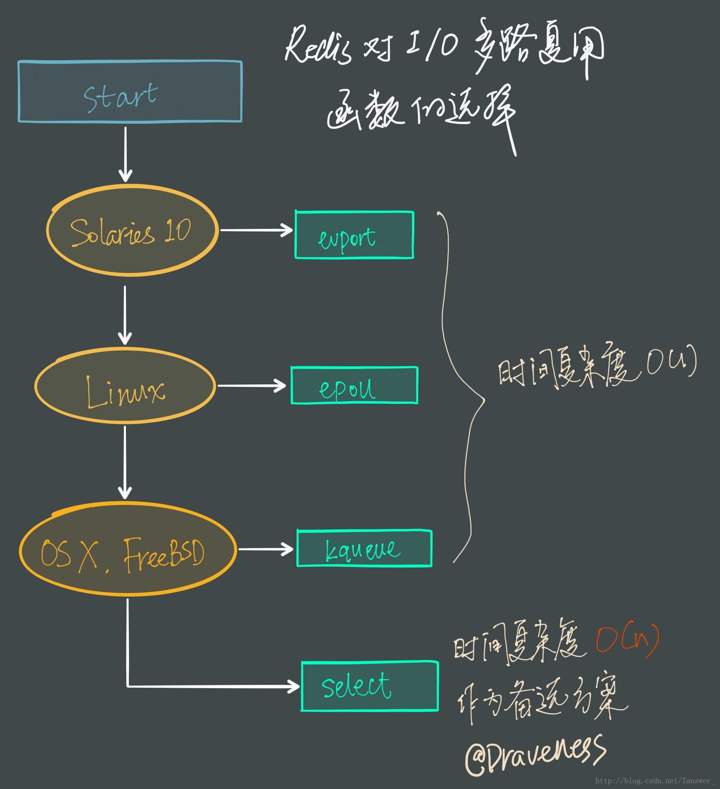

## 一 Redis为什么采用单线程的方式
在Redis的[FAQ](https://redis.io/topics/faq)中描述Redis单线程如何使用多cpu的回答中解释了为什么使用多线程
```text
Redis is single threaded. How can I exploit multiple CPU / cores?
It's not very frequent that CPU becomes your bottleneck with Redis, as usually Redis is either memory or network bound. For instance, using pipelining Redis running on an average Linux system can deliver even 1 million requests per second, so if your application mainly uses O(N) or O(log(N)) commands, it is hardly going to use too much CPU.

However, to maximize CPU usage you can start multiple instances of Redis in the same box and treat them as different servers. At some point a single box may not be enough anyway, so if you want to use multiple CPUs you can start thinking of some way to shard earlier.

You can find more information about using multiple Redis instances in the Partitioning page.

However with Redis 4.0 we started to make Redis more threaded. For now this is limited to deleting objects in the background, and to blocking commands implemented via Redis modules. For the next releases, the plan is to make Redis more and more threaded.
```

如上回答
- cpu通常不是Redis的瓶颈（内存和网络才是）
- 运行在linux上的redis平均的qps在100000，足够快了
- 多cpu机器可以运行多个实例来解决
- redis4.0版本会更多的使用多线程（但是应该还是单线程处理）

### 采用多线程可能带来的问题
- 不必要的上下文切换和竞争条件
- 多线程切换开CPU开销
- 存在在加锁释放锁操作，会造成死锁

## 二 多路复用
### 阻塞式IO

当使用 read 或者 write 对某一个文件描述符（File Descriptor 以下简称 FD)进行读写时，如果当前 FD 不可读或不可写，整个 Redis 服务就不会对其它的操作作出响应，导致整个服务不可用
### SELECT模型

在 I/O 多路复用模型中，最重要的函数调用就是 select，该方法的能够同时监控多个文件描述符的可读可写情况，当其中的某些文件描述符可读或者可写时，select 方法就会返回可读以及可写的文件描述符个数
### Reactor 设计模式
Redis 服务采用 Reactor 的方式来实现文件事件处理器（每一个网络连接其实都对应一个文件描述符）

文件事件处理器使用 I/O 多路复用模块同时监听多个 FD，当 accept、read、write 和 close 文件事件产生时，文件事件处理器就会回调 FD 绑定的事件处理器。

虽然整个文件事件处理器是在单线程上运行的，但是通过 I/O 多路复用模块的引入，实现了同时对多个 FD 读写的监控，提高了网络通信模型的性能，同时也可以保证整个 Redis 服务实现的简单

### I/O 多路复用模块

Redis对多路复用函数的选择

