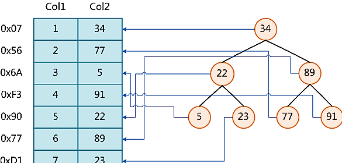

# Mysql Index
---
## 一 索引类型
### 1.1 hash index
哈希索引是基于哈希表实现，由于哈希的特性只支持等值比较查询(=/in()/<=>)，存储的数据无法进行排序查询且只有精确匹配到所有列的查询才生效，哈希索引在不冲突的情况下
查询速度很快，使用链地址法解决[哈希冲突](/markdown/java/hash.md)
### 1.2 b-tree index

### 1.3 innodb 聚集索引（Clustered Index）
聚集索引也是基于B+tree。与非聚集索引的区别则是，聚集索引既存储了索引，也存储了行值。当一个表有一个聚集索引，它的数据是存储在索引的叶子页（leaf pages）
#### 1.3.1 如何选择聚簇索引
|顺序|规则|
|:-|:-|
|1|如果一个主键被定义了，那么这个主键就是作为聚集索引|
|2|如果没有主键被定义，那么该表的第一个唯一非空索引被作为聚集索引|
|3|如果没有主键也没有合适的唯一索引，那么innodb内部会生成一个隐藏的主键作为聚集索引，这个隐藏的主键是一个6个字节的列，改列的值会随着数据的插入自增|
#### 1.3.2 优点
聚集索引是数据的排序实现。如果一个表的某个字段经常被用来排序，如果该字段在聚集索引列，则排序的时间就是查询的时间。同时，因为B-Tree同时保存了索引和数据值。因此通过聚集索引的检索会快于一个非聚集索引的检索
#### 1.3.3 缺点
如果一个很大的聚集索引被定义。那么所有的次级索引也会显而易见的大，因为次级索引存储了聚集索引的key。因为数据的存储方式，次级索引的查找需要两次。
聚集索引的列的值被更改后，聚集索引会对数据重排，因此主键被更改的开销是昂贵的。插入可能比较慢，如果数据不是按照主键的顺序插入。因此我们判断插入的数据的效率决定于插入的顺序。在innodb的表中，插入行按照主键的顺序插入式是最快的方式
## 二 执行计划中的类型
|类型|描述|
|:-|:-|
|system|only one row data in table  or null table，only happened in myisam and memory table。if using Innodb，type usually is all or index|
|const|using unique index or primary key，return one row data by where condition，the type is const|
|eq_ref|Appears in the query plan to join the table, the driver table returns only one row of data，and the row data is primary key or unique index of the second table|
|ref|happened when Conditional retrieval|
|fulltext|Full-text index search|
|ref_or_null|like ref，add null value compare|
|unique_subquery|where condition  sub query contains in，sub query result is unique value|
|index_subquery|like unique_subquery but sub query result is not unique, maybe have duplicate values|
|range|range select ，regularly happened in >,<,is null,between ,in ,like|
|[index_merge](/markdown/database/index-merge.md)|the index optimization is on and version is over 5.0, merge result by more than one index|
|index|select by index|
|ALL|scanning all table data|
## 三 索引失效
|序号|描述|
|:-|:-|
|1|如果条件中有or ,即使条件中带有索引也不会被使用|
|2|不匹配最左原则|
|3|like是以%开头的|
|4|如果列类型是字符型不使用引号|
