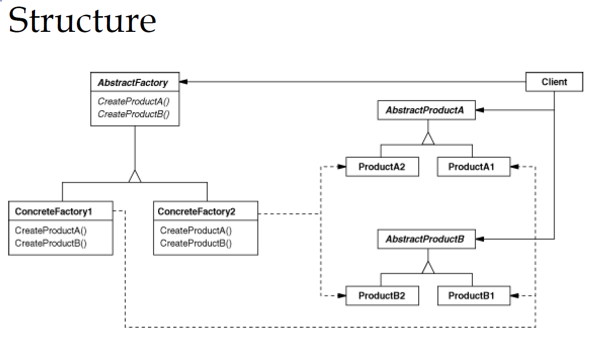

# Abstract Factory
---
抽象工厂模式(Abstract Factory Pattern)：提供一个创建一系列相关或相互依赖对象的接口，而无须指定它们具体的类。相当于在工厂方法上的再次抽象

### 以Spring的BeanFactory为例介绍

BeanFactory是用来获取Bean实例的，只介绍Factory部分，对Bean，AbstractBean, ConcreteBean不再描述
- BeanFactory
- AbstractBeanFactory 

- StubWebApplicationContext