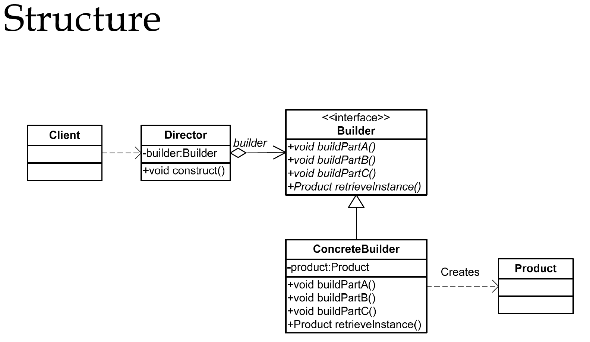

# Builder
在软件系统设计中，有时候面临着一个“复杂系统”的创建工作，该对象通常由各个部分的子对象用一定的算法构成，或者说按一定的步骤组合而成；这些的算法和步骤是稳定的，而构成这个对象的子对象却经常由于需求改变而发生变化。生活中有许多这方面的例子，譬如安装一台电脑，他的组装过程基本上是不变的，都可以由主板，CPU，内存等按照某个稳定方式组合而成。然而，主板、CPU和内存等零件，本身都是可能多变的，这就适用于Builder模式

### 以Lombok中的@Builder注解为例介绍
- 实体类
    ```java
    @Builder
    public class Student {
        private String name;
        private Integer age;
        private String schoolName;
        private Integer sex;
    }
    ```
- 编译后
    ```java
    public class Student {
        private String name;
        private Integer age;
        private String schoolName;
        private Integer sex;

        Student(String name, Integer age, String schoolName, Integer sex) {
            this.name = name;
            this.age = age;
            this.schoolName = schoolName;
            this.sex = sex;
        }

        public static Student.StudentBuilder builder() {
            return new Student.StudentBuilder();
        }

        public static class StudentBuilder {
            private String name;
            private Integer age;
            private String schoolName;
            private Integer sex;

            StudentBuilder() {
            }

            public Student.StudentBuilder name(String name) {
                this.name = name;
                return this;
            }

            public Student.StudentBuilder age(Integer age) {
                this.age = age;
                return this;
            }

            public Student.StudentBuilder schoolName(String schoolName) {
                this.schoolName = schoolName;
                return this;
            }

            public Student.StudentBuilder sex(Integer sex) {
                this.sex = sex;
                return this;
            }

            public Student build() {
                return new Student(this.name, this.age, this.schoolName, this.sex);
            }
        }
    }
    ```
- 使用
    ```java
    public static void main(String[] args) {
        Student mumu = Student.builder()
                .age(12)
                .name("mumu")
                .schoolName("Tsinghua")
                .sex(0)
                .build();
    }
    ```
