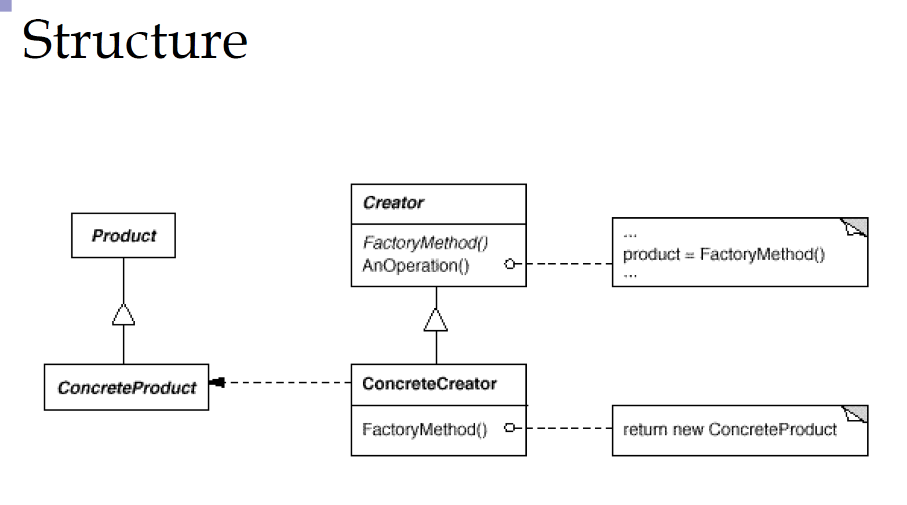
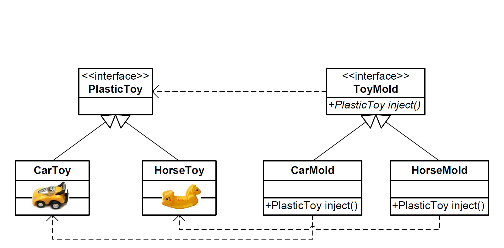

# Factory Method
---
在工厂方法模式中，工厂父类负责定义创建产品对象的公共接口，而工厂子类则负责生成具体的产品对象，这样做的目的是将产品类的实例化操作延迟到工厂子类中完成，即通过工厂子类来确定究竟应该实例化哪一个具体产品类。

### 工厂方法的组成部分
- Product(defines the interface of objects the factory creates)
- ConcreteProduct(implements the Product interface)
- Creator(declares the factory method, which returns an object of type Product)
- ConcreteCreator(overrides the factory method to return an instance of a ConcreteProduct, referred by Product)
### 以工厂使用模具生产塑料玩具场景介绍

- Product&ConcreteProduct
    ```java
    public interface PlasticToyProduct {
    
        String getToyName();
    }
    
    public class CarToy implements PlasticToyProduct {
    
        public String getToyName() {
            return "Plastic Car Toy";
        }
    }
    
    public class HorseToy implements PlasticToyProduct {
        public String getToyName() {
            return "Plastic Horse Toy ";
        }
    }
    ```
- Creator&ConcreteCreator
    ```java
    public interface ToyMoldFactory {
        PlasticToyProduct createProduct();
    }
    
    class CarMold implements ToyMoldFactory {
    
        public PlasticToyProduct createProduct() {
            return new CarToy();
        }
    }
    
    class HorseMold implements ToyMoldFactory {
    
        public PlasticToyProduct createProduct() {
            return new HorseToy();
        }
    }
    ```
