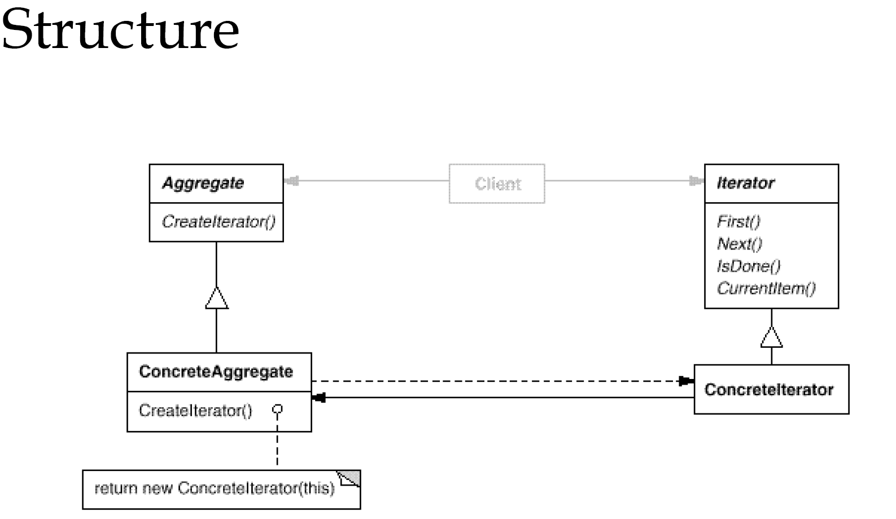

# Iterator
迭代子模式可以顺序地访问一个聚集中的元素而不必暴露聚集的内部表象


### Collection中的Iterator
```java
public interface Collection<E> extends Iterable<E> {

    int size();

    boolean isEmpty();

    boolean contains(Object o);

    Iterator<E> iterator();

    Object[] toArray();

    <T> T[] toArray(T[] a);

    boolean add(E e);

    boolean remove(Object o);

    boolean containsAll(Collection<?> c);

    boolean addAll(Collection<? extends E> c);

    boolean removeAll(Collection<?> c);

    boolean retainAll(Collection<?> c);

    void clear();

    boolean equals(Object o);

    int hashCode();
}
```
Collection实现了Iterable
```java
public interface Iterable<T> {

    /**
     * Returns an iterator over a set of elements of type T.
     *
     * @return an Iterator.
     */
    Iterator<T> iterator();
}

```

Iterator接口
```java
public interface Iterator<E> {

    boolean hasNext();

    E next();

    void remove();
}
```

