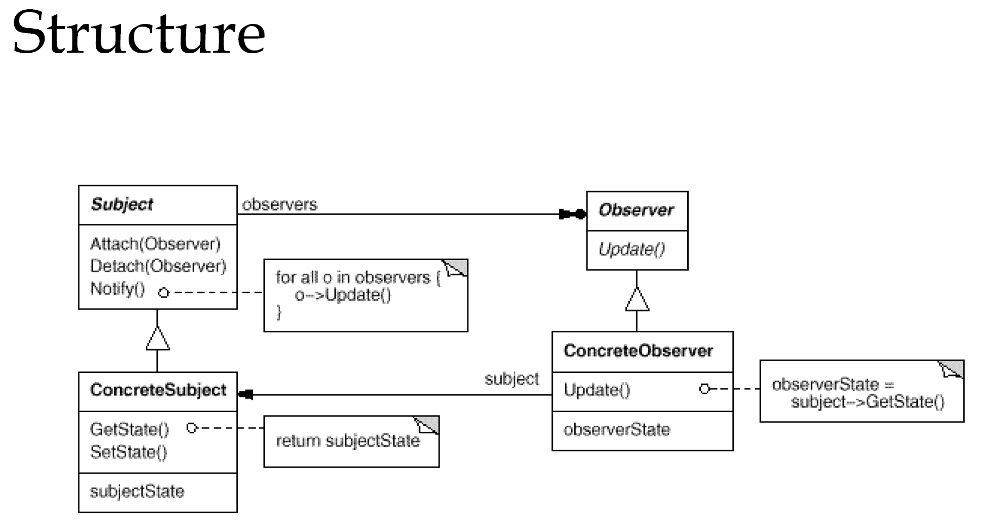

# Observer
观察者模式定义了一种一对多的依赖关系，让多个观察者对象同时监听某，一个主题对象。这个主题对象在状态上发生变化时，会通知所有观察者对象，使它们能够自动更新自己

### 以spring的ApplicationEventPublisher和ApplicationListener为例介绍
场景：班里新转来一个同学，其他同学监听老师介绍新同学事件

- ApplicationEvent
    ```java
    @Data
    @Builder
    public class StudentEvent extends ApplicationEvent implements Cloneable {
        private String name;
        private Integer age;
        private String schoolName;
        private Integer sex;

        public StudentEvent(Object source, String name, Integer age, String schoolName, Integer sex) {
            super(source);
            this.name = name;
            this.age = age;
            this.schoolName = schoolName;
            this.sex = sex;
        }
    }
    ```
    使用Spring的事件需要继承ApplicationEvent，ApplicationContext是可以发布ApplicationEvent的，因为它实现了ApplicationEventPublisherAware
    ```java
    public interface ApplicationContext extends EnvironmentCapable, ListableBeanFactory, HierarchicalBeanFactory, MessageSource, ApplicationEventPublisher, ResourcePatternResolver {
        String getId();

        String getApplicationName();

        String getDisplayName();

        long getStartupDate();

        ApplicationContext getParent();

        AutowireCapableBeanFactory getAutowireCapableBeanFactory() throws IllegalStateException;
    }
    ```
- ApplicationEventPublisher
    ```java
    @Component
    public class TeacherPublisher implements ApplicationEventPublisherAware {

        private ApplicationEventPublisher publisher;

        public void setApplicationEventPublisher(ApplicationEventPublisher applicationEventPublisher) {
            publisher = applicationEventPublisher;
        }

        public void publish() {
            publisher.publishEvent(new StudentEvent(this,"mumu", 12, "Tsinghua", 0 ));
        }
    }
    ```
    在事件的发布方需要实现ApplicationEventPublisherAware接口获得ApplicationEventPublisher，然后执行publishEvent()方法

- ApplicationListener
    ```java
    @Component
    public class StudentListerner implements ApplicationListener<StudentEvent> {
        public void onApplicationEvent(StudentEvent student) {
            // handle the event
        }
    }
    ```
    可以定义多个Listerner去监听StudentEvent事件
