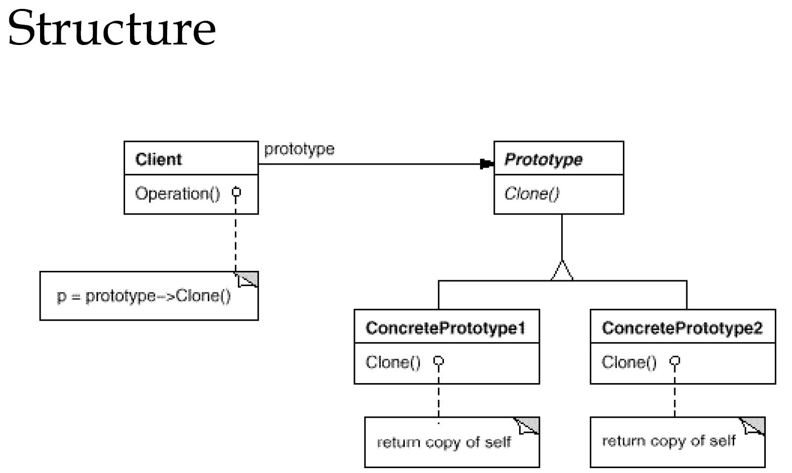

# 原型模式
---
### Specify the kinds of objects to create using a prototypical instance, and create new objects by copying this prototype.

- Shallow Copy(`Object.clone()`)<br>
    A new object is created that has an
    exact copy of the values in the original object. If any of
    the fields of the object are references to other objects,
    just the references are copied
    ```java
    @Builder
    public class Student implements Cloneable {
        private String name;
        private Integer age;
        private String schoolName;
        private Integer sex;
    
        public static void main(String[] args) throws CloneNotSupportedException {
            Student mumu = Student.builder()
                    .age(12)
                    .name("mumu")
                    .schoolName("Tsinghua")
                    .sex(0)
                    .build();
            Student aa = (Student) mumu.clone();
    
            System.out.println(aa.equals(mumu));
        }
    
        @Override
        protected Object clone() throws CloneNotSupportedException {
            return super.clone();
        }
    }
    ```
    Object.clone()方法默认实现是浅拷贝，且必须实现Cloneable接口，否则会抛`java.lang.CloneNotSupportedException`
- Deep Copy(`org.springframework.util.LinkedMultiValueMap.deepCopy()`)<br>
    It is a complete duplicate copy of an object.
    A deep copy generates a copy not only of the primitive
    values of the original object, but copies of all subobjects
    as well, all the way to the bottom, it is field-forfield
    copy .
    ```java
	/**
	 * Create a deep copy of this Map.
	 * @return a copy of this Map, including a copy of each value-holding List entry
	 * @since 4.2
	 * @see #clone()
	 */
	public LinkedMultiValueMap<K, V> deepCopy() {
		LinkedMultiValueMap<K, V> copy = new LinkedMultiValueMap<>(this.targetMap.size());
		this.targetMap.forEach((key, value) -> copy.put(key, new LinkedList<>(value)));
		return copy;
	}
    ```