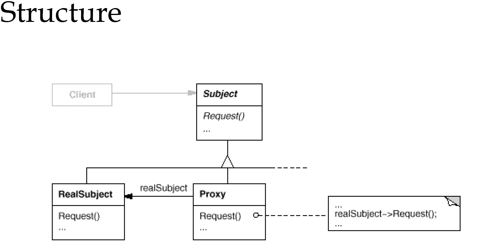

# 代理模式
---
### Provide a surrogate or placeholder for another object to control access to it.

```java
public interface Book {
    void buyBook();
}

class BookImp implements Book {
    public void buyBook() {
        System.out.println("buy a book from bookStore");
    }
}

class BookProxy extends BookImp {
    @Override
    public void buyBook() {
        buyBookFromOnlineShop();
    }

    void buyBookFromOnlineShop() {
        System.out.println("buy a book online");
        super.buyBook();
    }
}
```
Book接口定义了买书的需求，BookProxy对买书的需求进行代理实现。复杂的代理实现点击[JDK和Spring的AOP](/markdown/spring/aopProxy.md)
