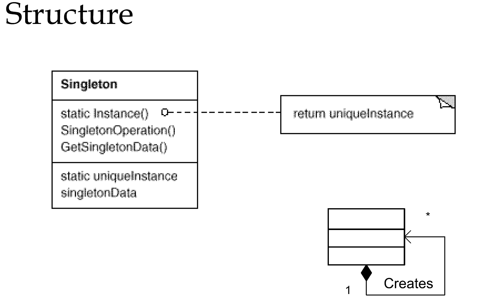

# 单利模式(Ensure a class only has one instance, and provide a global point of access to it)
---
### Ensure a class only has one instance, and provide a global point of access to it.

## 一 EagerSingleton 
饿汉模式 先初始化 再提供方法调用

    public class EagerSingleton {
       public static EagerSingleton uniqueInstance = new EagerSingleton();
       public static EagerSingleton getInstance(){
    	   return uniqueInstance ;
       }
    }
## 二 LazySingleton
懒汉模式 调用时验证 再赋值 在多线程下有隐患
## 2.1 单利习语
	public static LazySingleton getInstance(){
	    if(null == uniqueInstance){
			uniqueInstance = new LazySingleton();
	    }
	    return uniqueInstance ;
    }
线程不安全
## 2.2 线程安全的单利 锁方法 
	public static synchronized LazySingleton getInstance2(){
		if(null == uniqueInstance){
			uniqueInstance = new LazySingleton();
		}
		return uniqueInstance ;
	}
但是每次获取实例的时候都要承受方法锁的开销
## 2.3 线程安全的单利 锁第一次初始化
	public static LazySingleton getInstance3(){
		if(null == uniqueInstance){
			synchronized (LazySingleton.class) {
				uniqueInstance = new LazySingleton();
			}
		}
		return uniqueInstance ;
	}
当 instance 为 null 时，两个线程可以并发地进入 if 语句内部。然后，一个线程进入 synchronized 块来初始化 instance，
而另一个线程则被阻断。当第一个线程退出 synchronized 块时，等待着的线程进入并创建另一个 Singleton 对象。
注意：当第二个线程进入 synchronized 块时，它并没有检查 instance 是否非 null
## 2.4 线程安全的单利 双重检验
	public static LazySingleton getInstance4(){
		if(null == uniqueInstance){ //1
			synchronized (LazySingleton.class) { //2
				if (null == uniqueInstance) { //3
					uniqueInstance = new LazySingleton(); //4
				}
			}
		}
		return uniqueInstance ;
	}
由于3的问题 我们需要对 instance 进行第二次检查。这就是“双重检查锁定”名称的由来，双重检查锁定背后的理论是完美的。不幸地是，现实完全不同。双重检查锁定的问题是：并不能保证它会在单处理器
或多处理器计算机上顺利运行。双重检查锁定失败的问题并不归咎于 JVM 中的实现 bug，而是归咎于 Java 平台内存模型。
内存模型允许所谓的“无序写入”，这也是这些习语失败的一个主要原因 

有两个线程A、B同时先后入执行1 B线程会等待A线程执行结束，然后A执行完2，3，4之后B开始执行 由于B线程拷贝了自己的一份数据
并没有被初始化，所以在执行完2之后lazyInstance 还是null 造成初始化两次instance
## 2.5 使用volatile保证线程可见性 来避免无序写入
    private static volatile LazySingleton uniqueInstance ;
