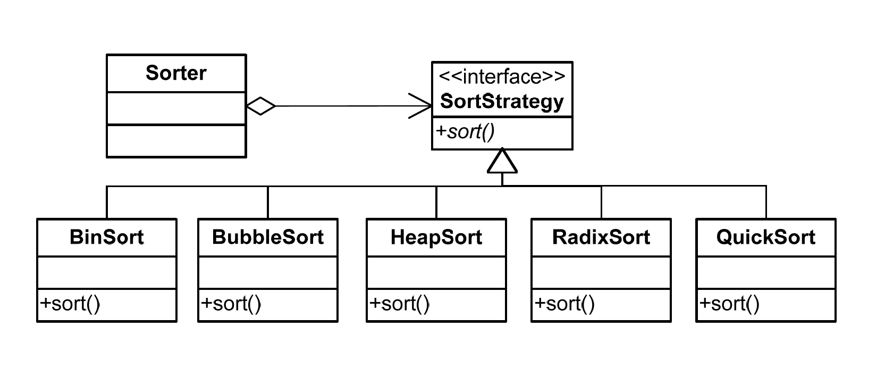

# 策略模式
---
### Define a family of algorithms, encapsulate each one, and make them interchangeable. Strategy lets the algorithm vary independently from clients that use it.

### 以[eslatic-job](http://elasticjob.io/docs/elastic-job-lite/00-overview/)中的分片策略为例介绍
针对一组算法， 将每一个算法封装到具有共同接口的独立的类中，满足里氏替换原则，策略模式可以使得算法可以在不影响客户端的情况下发生变化
```java
/**
 * 作业分片策略.
 * @author zhangliang
 */
public interface JobShardingStrategy {
    
    /**
     * 作业分片.
     * 
     * @param jobInstances 所有参与分片的单元列表
     * @param jobName 作业名称
     * @param shardingTotalCount 分片总数
     * @return 分片结果
     */
    Map<JobInstance, List<Integer>> sharding(List<JobInstance> jobInstances, String jobName, int shardingTotalCount);
}
```
- 基于平均分配算法的分片策略
    ```java
    /**
     * 如果分片不能整除, 则不能整除的多余分片将依次追加到序号小的服务器.
     * 如: 
     * 1. 如果有3台服务器, 分成9片, 则每台服务器分到的分片是: 1=[0,1,2], 2=[3,4,5], 3=[6,7,8].
     * 2. 如果有3台服务器, 分成8片, 则每台服务器分到的分片是: 1=[0,1,6], 2=[2,3,7], 3=[4,5].
     * 3. 如果有3台服务器, 分成10片, 则每台服务器分到的分片是: 1=[0,1,2,9], 2=[3,4,5], 3=[6,7,8].
     */
    public final class AverageAllocationJobShardingStrategy implements JobShardingStrategy {
        
        @Override
        public Map<JobInstance, List<Integer>> sharding(final List<JobInstance> jobInstances, final String jobName, final int shardingTotalCount) {
            if (jobInstances.isEmpty()) {
                return Collections.emptyMap();
            }
            Map<JobInstance, List<Integer>> result = shardingAliquot(jobInstances, shardingTotalCount);
            addAliquant(jobInstances, shardingTotalCount, result);
            return result;
        }
        
        private Map<JobInstance, List<Integer>> shardingAliquot(final List<JobInstance> shardingUnits, final int shardingTotalCount) {
            Map<JobInstance, List<Integer>> result = new LinkedHashMap<>(shardingTotalCount, 1);
            int itemCountPerSharding = shardingTotalCount / shardingUnits.size();
            int count = 0;
            for (JobInstance each : shardingUnits) {
                List<Integer> shardingItems = new ArrayList<>(itemCountPerSharding + 1);
                for (int i = count * itemCountPerSharding; i < (count + 1) * itemCountPerSharding; i++) {
                    shardingItems.add(i);
                }
                result.put(each, shardingItems);
                count++;
            }
            return result;
        }
        
        private void addAliquant(final List<JobInstance> shardingUnits, final int shardingTotalCount, final Map<JobInstance, List<Integer>> shardingResults) {
            int aliquant = shardingTotalCount % shardingUnits.size();
            int count = 0;
            for (Map.Entry<JobInstance, List<Integer>> entry : shardingResults.entrySet()) {
                if (count < aliquant) {
                    entry.getValue().add(shardingTotalCount / shardingUnits.size() * shardingUnits.size() + count);
                }
                count++;
            }
        }
    }
    ```
- 根据作业名的哈希值奇偶数决定IP升降序算法的分片策略
    ```java
    /**
     * <p>
     * 作业名的哈希值为奇数则IP升序.
     * 作业名的哈希值为偶数则IP降序.
     * 用于不同的作业平均分配负载至不同的服务器.
     * 如: 
     * 1. 如果有3台服务器, 分成2片, 作业名称的哈希值为奇数, 则每台服务器分到的分片是: 1=[0], 2=[1], 3=[].
     * 2. 如果有3台服务器, 分成2片, 作业名称的哈希值为偶数, 则每台服务器分到的分片是: 3=[0], 2=[1], 1=[].
     */
    public final class OdevitySortByNameJobShardingStrategy implements JobShardingStrategy {
        
        private AverageAllocationJobShardingStrategy averageAllocationJobShardingStrategy = new AverageAllocationJobShardingStrategy();
        
        @Override
        public Map<JobInstance, List<Integer>> sharding(final List<JobInstance> jobInstances, final String jobName, final int shardingTotalCount) {
            long jobNameHash = jobName.hashCode();
            if (0 == jobNameHash % 2) {
                Collections.reverse(jobInstances);
            }
            return averageAllocationJobShardingStrategy.sharding(jobInstances, jobName, shardingTotalCount);
        }
    }
    ```
- 根据作业名的哈希值对服务器列表进行轮转的分片策略
    ```java
    public final class RotateServerByNameJobShardingStrategy implements JobShardingStrategy {
        
        private AverageAllocationJobShardingStrategy averageAllocationJobShardingStrategy = new AverageAllocationJobShardingStrategy();
    
        @Override
        public Map<JobInstance, List<Integer>> sharding(final List<JobInstance> jobInstances, final String jobName, final int shardingTotalCount) {
            return averageAllocationJobShardingStrategy.sharding(rotateServerList(jobInstances, jobName), jobName, shardingTotalCount);
        }
        
        private List<JobInstance> rotateServerList(final List<JobInstance> shardingUnits, final String jobName) {
            int shardingUnitsSize = shardingUnits.size();
            int offset = Math.abs(jobName.hashCode()) % shardingUnitsSize;
            if (0 == offset) {
                return shardingUnits;
            }
            List<JobInstance> result = new ArrayList<>(shardingUnitsSize);
            for (int i = 0; i < shardingUnitsSize; i++) {
                int index = (i + offset) % shardingUnitsSize;
                result.add(shardingUnits.get(index));
            }
            return result;
        }
    }
    ```