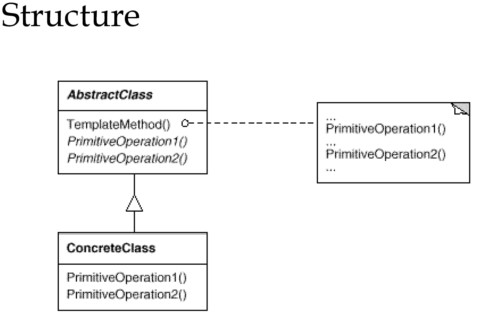

# 模板方法
---
### 准备一个抽象类，将部分逻辑以具体方法以及具体子构造的形式实现，然后声明一些抽象方法来迫使子类实现剩余的逻辑不同的子类可以以不同的形式实现这些抽象方法，从而对剩余的逻辑有不同的实现

### 以spring-data-eslaticSearch为例介绍
- AbstractElasticsearchRepository
    ```java
    public abstract class AbstractElasticsearchRepository<T, ID extends Serializable>
            implements ElasticsearchRepository<T, ID> {
    
        static final Logger LOGGER = LoggerFactory.getLogger(AbstractElasticsearchRepository.class);
        protected ElasticsearchOperations elasticsearchOperations;
        protected Class<T> entityClass;
        protected ElasticsearchEntityInformation<T, ID> entityInformation;
    
        @Override
        public Iterable<T> findAll() {
            int itemCount = (int) this.count();
            if (itemCount == 0) {
                return new PageImpl<>(Collections.<T> emptyList());
            }
            return this.findAll(PageRequest.of(0, Math.max(1, itemCount)));
        }
    
        @Override
        public Page<T> findAll(Pageable pageable) {
            SearchQuery query = new NativeSearchQueryBuilder().withQuery(matchAllQuery()).withPageable(pageable).build();
            return elasticsearchOperations.queryForPage(query, getEntityClass());
        }
    
        ...

        private List<String> stringIdsRepresentation(Iterable<ID> ids) {
            Assert.notNull(ids, "ids can't be null.");
            List<String> stringIds = new ArrayList<>();
            for (ID id : ids) {
                stringIds.add(stringIdRepresentation(id));
            }
            return stringIds;
        }
    
        protected abstract String stringIdRepresentation(ID id);
    
        private Long extractVersionFromBean(T entity) {
            return entityInformation.getVersion(entity);
        }
    
        private String extractParentIdFromBean(T entity) {
            return entityInformation.getParentId(entity);
        }
    }
    ```
- UUIDElasticsearchRepository 实现 AbstractElasticsearchRepository 模板
    ```java
    public class UUIDElasticsearchRepository<T> extends AbstractElasticsearchRepository<T, UUID> {
    
        public UUIDElasticsearchRepository() {
            super();
        }
    
        public UUIDElasticsearchRepository(ElasticsearchEntityInformation<T, UUID> metadata,
                                             ElasticsearchOperations elasticsearchOperations) {
            super(metadata, elasticsearchOperations);
        }
    
        public UUIDElasticsearchRepository(ElasticsearchOperations elasticsearchOperations) {
            super(elasticsearchOperations);
        }
    
        @Override
        protected String stringIdRepresentation(UUID id) {
            return (id != null) ? id.toString() : null;
        }
    }
    
    ```