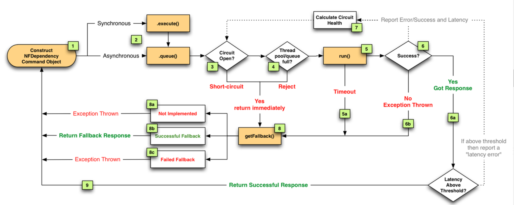

## Hystrix


### 1.创建HystrixCommand或HystrixObervableCommand对象
首先创建HystrixCommand 或HystrixObservableCommand对象，用来表示对依赖服务的操作请求，同时传递所有需要的参数。从命名就可以看出采用了命令模式来实现对服务调用操作的封装，而这两个Command对象分别针对不同的引用场景。
- HystrixCommand : 用在依赖的服务返回单个的操作结果的时候
- HystrixObservableCommand：用在依赖的服务返回多个操作结果的时候
命令模式将来自客户端的请求封装成一个对象，从而可以使用不同的请求对客户端进行参数化，可以被用于实现“行为请求者”和“行为实现者的解耦”
命令者模式
下面以一个示意性的系统，说明命令模式的结构。

命令模式涉及到五个角色，它们分别是：
- 客户端(Client)角色：创建一个具体命令(ConcreteCommand)对象并确定其接收者。
- 命令(Command)角色：声明了一个给所有具体命令类的抽象接口。
- 具体命令(ConcreteCommand)角色：定义一个接收者和行为之间的弱耦合；实现execute()方法，负责调用接收者的相应操作。execute()方法通常叫做执行方法。
- 请求者(Invoker)角色：负责调用命令对象执行请求，相关的方法叫做行动方法。
- 接收者(Receiver)角色：负责具体实施和执行一个请求。任何一个类都可以成为接收者，实施和执行请求的方法叫做行动方法。
### 2.命令执行
hystrix一共有四种命令执行的方式，其中HystrixCommand实现了下面两个执行方式
- execute():同步执行，从依赖的服务返回一个单一的结果对象，或是在发生错误的时候抛出异常
        ```java
        R value = command.execute()
        ```
- queue():异步执行，直接返回一个Feature对象其中包含了服务请求结束时返回的单一结果对象
        ```java
            Future<R>  fValue = command.queue()
        ```
HystrixObservableCommand实现了另外两种执行方式
- observe():返回Observable对象，它代表了操作的多个结果，它是一个Hot Observable
        ```java
            Observable<R>  ohValue = commond.observe()
        ```
- toObservable():同样是Observable对象，也代表了操作的多个结果，但是是一个cold Observable
        ```java
        Observable<R>  ocValue = commond.toObservable()
        ```
##### Observable   
- Hot Observable: 无论事件源有没有订阅者，都会在创建后对事件进行发布，所以对于Hot Observable的每个订阅者都有可能是从事件源的中途开始的，并有可能只看见了整个操作的局部过程<br>
- Cold Observable : 没有订阅者的时候不会发布事件，而是进行等待，直到有订阅者的之后才发布事件，对于Cold Observable的订阅者，它可以保证从一开始看到整个操作的全过程
### 3.结果是否被缓存
   如果当前命令的请求缓存功能被启用，并且请求该缓存
### 4.断路器是否被打开
   在没有命中缓存的时候，Hystrix在执行命令前需要检查断路器是否为打开状态，如果为打开状态，那么Hystrix就不会执行命令，而是转到fallback处理逻辑（对应第八步），如果断路器是关闭的则调到第五步,检查是否有可用的资源来执行命令。
### 5.线程池/请求队列/信号量是否占满
   如果被占满就会直接跳转到步骤8
### 6.执行HystrixObservableCommand.construct()或HystrixCommond.run()
   - HystrixObservableCommand.construct() : 返回一个单一的结果或抛出异常
   - HystrixCommond.run()：返回一个Observable对象来发射多个结果，或通过onError发送错误通知
   run()或construct()方法执行时间超过命令设置的超时阈值，线程会抛出一个RunTimeException,这种情况下会跳转到fallBack处理逻辑
#### 7.计算健康度
   Hystrix会将“成功”，“失败”，“拒绝”，“超时”等信息报告给断路器，断路器会维护一组计数器来统计这些数据，断路器会使用这些数据统计来决定是否要打开断路器，来对某个服务请求进行熔断/短路，直到恢复期结束，若恢复期结束后还未达到健康指标，就再次断路
### 8.fallBack处理
   在服务降级逻辑中，需要实现一个通用的响应结果，并且相应结果的处理逻辑应该是从缓存或根据一些静态逻辑来获取，而不是依赖网络请求获取，如果一定要在降级策略中包含网络请求，那么该请求也必须被包装在HystrixCommand 或HystrixObservableCommand中。
### 9.成功返回响应
   当Hystrix命令执行成功，它会将处理结果直接返回，或是以Observable的形式返回
