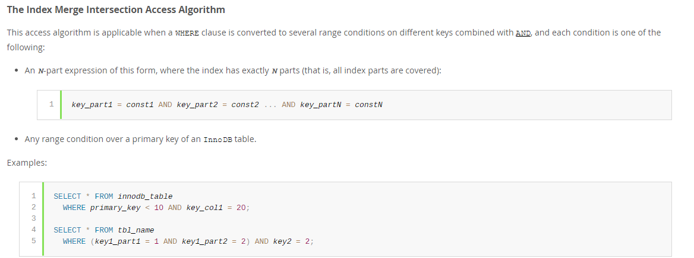
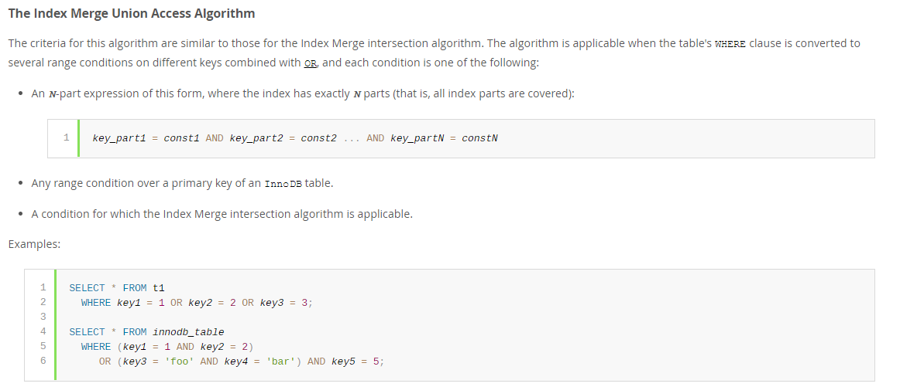

# Index-merge(mysql 执行计划的type是index-merge)
---
## 一 index_merge被使用的前提条件 
|index_merge被使用的前提条件|
|:-| 
|(1)mysql版本5.0以上|
|(2)查询优化器开启了index_merge_union=on|
## 二 index_merge 是什么

简单来说就是对多个索引分别进行条件扫描，然后将它们各自的结果进行合并
## 三 index_merge的合并方式
### 3.1 intersect(取交集)    
 
#### intersect是以and连接不同的条件，并且每个条件要满足以下条件之一
|条件|
|:-|
|(1)一个N个查询条件的查询，N个条件的字段都存在索引，且都不是范围条件(例如 < ）|
|(2)范围条件(例如 < ）是主键|    
### 3.2 union
  
#### union是以or连接不同的条件,并且每个条件要满足以下条件之一
|条件|
|:-|
|(1)一个N个查询条件的查询，N个条件的字段都存在索引，且都不是范围条件(例如 < ）|
|(2)并且范围条件(例如 < ）是主键|  
|(3)这个条件是intersect 适用的|
### 3.3 sort-union
  
#### sort-union是以or连接，并且不同的条件中使用了不同的联合索引（例如四个索引 如上图两个条件 分别为(key1 and key2) 与 (key3 and key4)的两个索引树进行取并集,并且每个条件要满足以下条件之一
|条件|
|:-|
|(1)sort-union是以or连接，并且不同的条件中使用了不同的联合索引（例如四个索引 如上图两个条件 分别为(key1 and key2) 与 (key3 and key4)的两个索引树进行取并集,并且每个条件要满足以下条件之一|
|(2)一个N个查询条件的查询，N个条件的字段都存在索引，且都不是范围条件(例如 < ）|  
|(3)并且范围条件(例如 < ）是主键|
|(4)这个条件是intersect 适用的|
### 3.4 Sort_union 和 union的区别
sort-union是用两个或者两个以上的key提取数据，但优化器无法确保每个key会提取到一个自然排好序的结果,而且innoDB要求返回一个自然排序之后的结果，所以sort-union先获取必须首先获取所有
 行的行ID，并在返回任何行之前进行排序。
## 四 总结   
index merge使得我们可以使用到多个索引同时进行扫描，然后将结果进行合并。听起来好像是很好的功能，但是如果出现了 index_merge，
那么也意味着我们的索引建的不太合理，因为 index_merge 是可以通过建复合索引进行更一步优化的(使用一个索引树获取结果集)。

