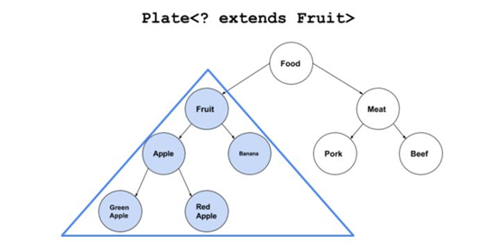
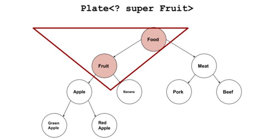

# 泛型
---
## 一 概念
泛型是一种参数化类型的机制。它可以使得代码适用于各种类型，从而编写更加通用的代码。例如定一个泛型容器Plate去存放对象，使用泛型可以实现向容器中存放各种类型的对象，实现容器的通用性
    
## 二 泛型变量定义规范(大写字母)
### 2.1 字母语义(为提高可读性建议)
|:字母|:语义|
|:E|:Element (在集合中使用，因为集合中存放的是元素)|
|:T|:Type（Java 类）|
|:K|:Key（键）|
|:V|:Value（值）|
|:N|:Number（数值类型）|

## 三 泛型的类型擦除
Java中的泛型并不是像c语言一样对泛型有描述符去描述，而是在编译的时候会被类型擦除，所以Java的泛型也被叫做伪泛型。
	
    public static int method(List<Integer> list) {
        return 0;
    }

    public static String method(List<String> list) {
        return "";
    }

如上代码两个method的方法入参类型不同，但是编译提示是两个方法有相同的凝结符，因为在泛型擦除的时候，两个方法擦除泛型的类型，两个方法就变成相同的（注：在class文件中对方法的描述是方法名+入参类型+返回值类型），
在编译的时候泛型擦除后，对针对相应的地方插入类型强转代码，所以在jvm运行时候要执行强制转换的代码，如果这时类型不匹配会造成， 
java.lang.ClassCastException，Java虚拟机为了避免不必要的转换异常，所以在编译的时候会对代码进行检查和限制。

## 四 通配符
    class Fruit {}
    class Apple extends Fruit {}
    class Plate<T> {   
        private T item;
        public Plate(T t) {
            item = t;
        }
        public T getItem() {
            return item;
        }
        public void setItem(T item) {
            this.item = item;
        }
    }
    
    Plate<Fruit> plate = new Plate<Apple>(new Apple());

<因为在编译擦除后要将Apple强转成Fruite，这个强转的过程并不能保证不会抛出转换异常，所以编译校验失败，通配符分为两种分别为上界通配符
和下界通配符
    	
### 4.1 上界通配符

    Plate<? extends Fruit> plate = new Plate<Apple>(new Apple());
    Fruit fruit = plate.getItem();
使用extend就是给泛型指定上界，当使用容器去get的时候，会给返回一个上界类型的对象，因为从子类转换到父类是肯定不会转换异常的

### 4.2 下界通配符

    Plate<? super Fruit> plate = new Plate<Fruit>(new Fruit());
    plate.setItem(new Fruit());
使用super就是给泛型指定下界