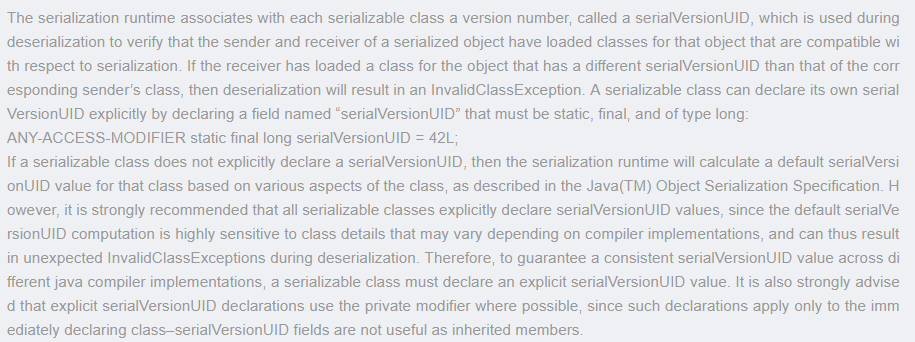

# Serializable、Externalizable
---
## Serializable 版本号


## transient
在实际开发过程中会遇到这个类的有些属性需要序列化，而其他属性不需要被序列化的场景（由于安全等原因），
java 的transient关键字为我们提供了便利，你只需要实现Serilizable接口，将不需要序列化的属性前添加关键字transient则字段不会被序列化

## Externalizable 序列化
```java
@Data
public class Person implements Externalizable {

    private String name;
    private Integer age;

    public void writeExternal(ObjectOutput out) throws IOException {
        out.writeObject(name);
        out.writeObject(age);
    }

    public void readExternal(ObjectInput in) throws IOException, ClassNotFoundException {
        this.name=(String)in.readObject();
        this.age=(Integer) in.readObject();
    }
}
```
## @Transient

@Table(name="person")  
public class Person{  
    private Date birth;  
    @Column(name = "birth")  
    public Date getBirth() {  
        return birth;  
    }  
    public void setBirth(Date birth) {  
        this.birth = birth;  
    }  
    @Transient  
    public int getAge(){  
        return getYear(new Date())-getYear(getBirth());    //getYear为类中的自定义方法，返回传入日期的年份  
    }  
}  