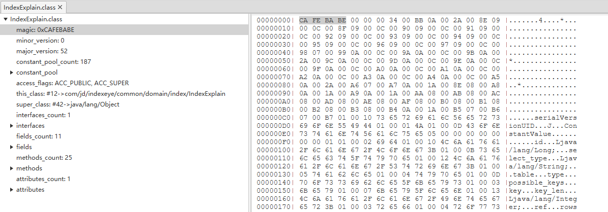

# Class类文件结构(GO语言描述)
---
## 一 Class文件
使用classpy-0.4.jar 打开文件如下图

### 1.1 魔法数字
所有class文件的版本号都必须是0xCAFEBABE

    /**
     * 读取字节流文件且校验文件格式(magic number) class文件的magic number是0xCAFEBABE
     */
    func (self *ClassFile) readAndCheckMagic(reader *ClassReader) {
    	magic := reader.readUnit32()
    	if magic != 0xCAFEBABE {
    		panic("java.lang.ClassFormatError: magic!")
    	}	
    }

### 1.2 版本号
特定的Java虚拟机只支持版本号在某个范围内的class文件 oracle实现的是完全向后兼容的

    /**
     * 版本号校验 
     *     Java版本                     class文件版本号
     *     jdk1.0.2                     45.0 - 45.3
     *     jdk1.1                       45.0 - 45.65535
     *     J2SE1.2                      46.0
     *     J2SE1.3                      47.0
     *     J2SE1.4                      48.0
     *     JavaSE5.0                    49.0
     *     JavaSE6.0                    50.0
     *     JavaSE7.0                    51.0
     *     JavaSE8.0                    52.0
     */
    
    func (self *ClassFile) readAndCheckVersion(reader *ClassReader) {
        self.minorVersion = reader.readUnit16()
        self.majorVersion = reader.readUnit16()
        switch self.majorVersion {
        case 45:
            return
        case 46, 47, 48, 49, 50, 51, 52:
            if self.minorVersion == 0 {
                return
            }
        }
        panic("java.lang.UnsupportedClassVersionError!")
    }    

### 1.3 常量池
    
Java虚拟机规范定义了十四种常量
   
    //结构 
    cp_info {
      u1 tag;
       u1 info[];
    }
    
    const (        
        CONSTANT_Utf8 = 1
        CONSTANT_Integer = 3
        CONSTANT_Float = 4
        CONSTANT_Long = 5
        CONSTANT_Double = 6
        CONSTANT_Class = 7
        CONSTANT_String = 8
        CONSTANT_Fieldref = 9                     字段符号引用
        CONSTANT_Methodref = 10                   方法符号引用
        CONSTANT_InterfaceMethodref = 11          接口方法符号引用
        CONSTANT_NameAndType = 12
        CONSTANT_MethodHandle = 15
        CONSTANT_MethodType = 16
        CONSTANT_InvokeDynamic = 18
    )
    
### 1.4 访问标识(access_flags)用于识别一些类或者接口层面的信息
|标识名称|标志值|含义|针对对象|
|:-|:-|:-|:-|
|ACC_PUBLIC|0x0001|public类型|所有类型|
|ACC_FINAL|0x0010|final类型|类|
|ACC_SUPER|0x0020|使用新的invokespecial语义|类和接口|
|ACC_INTERFACE|0x0200|接口类型|接口|
|ACC_ABSTRACT|0x0400|抽象类型|类和接口|
|ACC_SYNTHETIC|0x1000|该类不由用户代码生成|所有类型|
|ACC_ANNOTATION |0x2000|注解类型|注解|
|ACC_ENUM  |0x4000|枚举类型|枚举|

