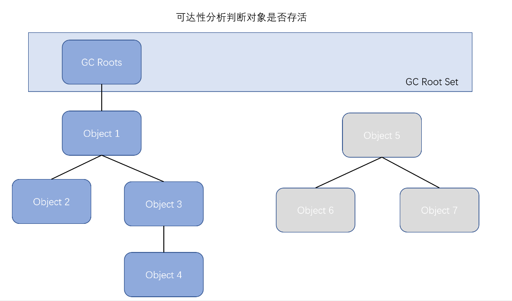
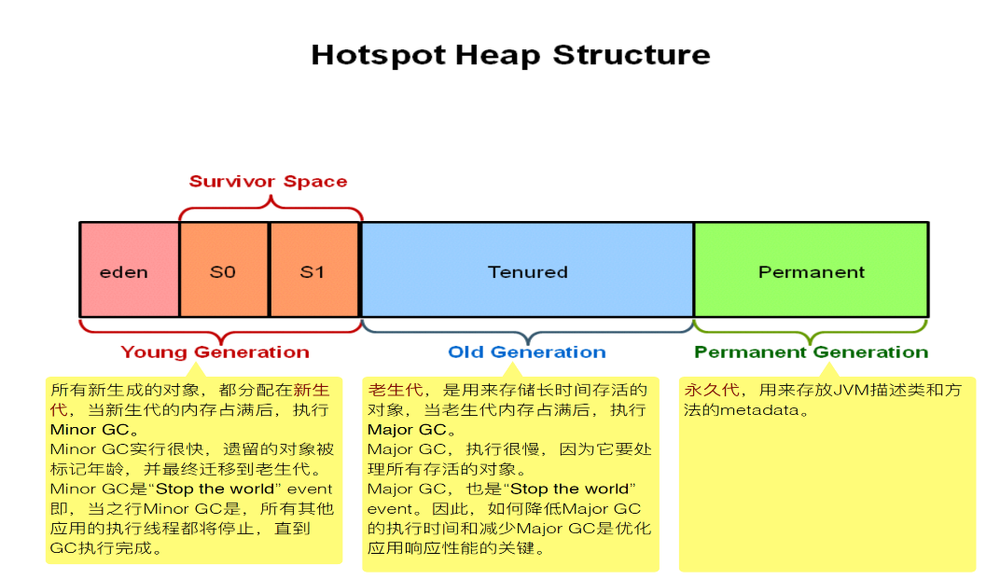
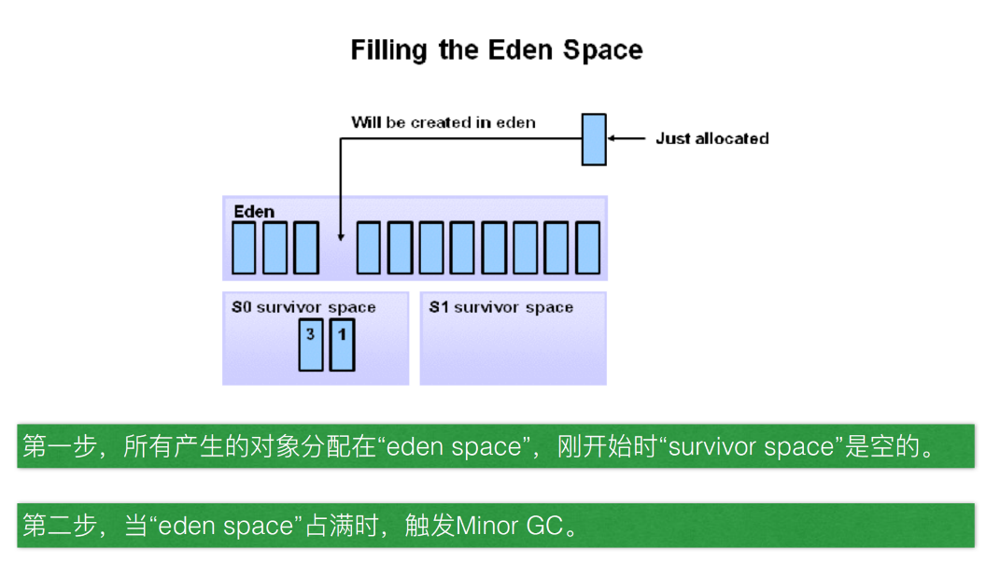
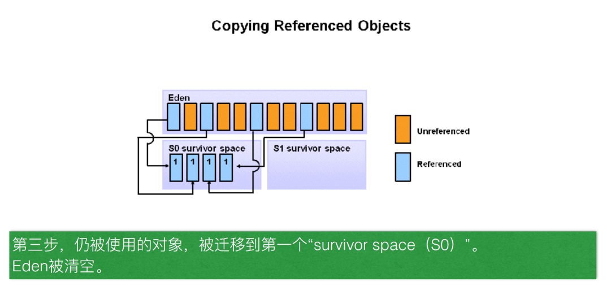
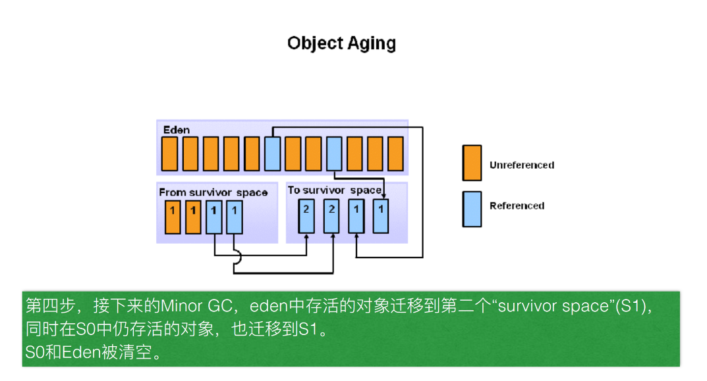
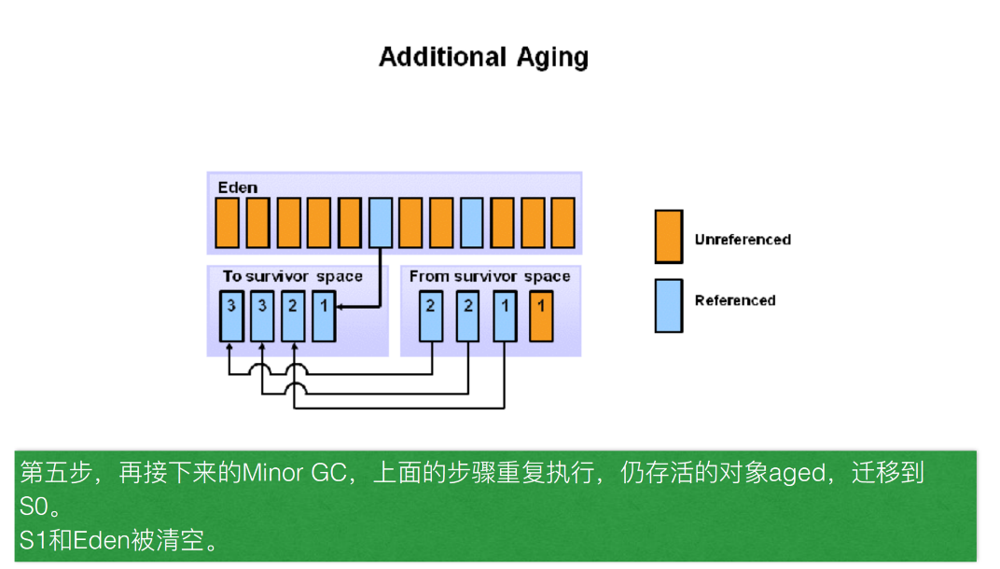
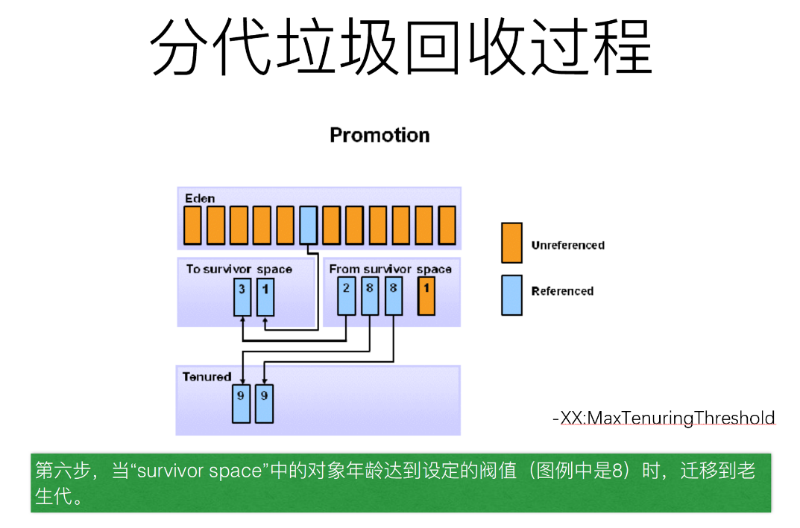
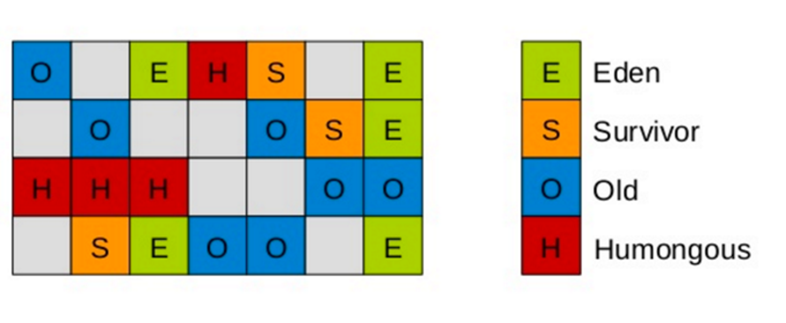

# Garbage Collection
---
## 一 垃圾回收算法
### 1 标记-清除算法
分为标记和清除两个阶段 首先是标记需要回收的对象，然后在标记后统一回收被标记的所有对象不足 
效率问题 : 标记和清除两个阶段的效率都不高 
空间问题 : 标记和清除之后会产生大量的不连续的内存碎片，导致不能被分配给占用，大空间的对象，当无法找到足够连续的内存而不得已提前触发一次垃圾收集工作
### 2 复制-算法
为了解决效率问题，一种称为复制的收集算法出现，它将可使用的内存分为两块，每次只使用其中的一块，当这一次内存清理之后把存活的对象复制到另外一块内存上，然后把使用过的内存清理掉 
优点 : 这样只需要进行半块内存的回收，而且会避免掉内存碎片的问题，运行简单会提升效率 
不足 : 这样会造成可使用的内存空间只剩下一半
### 3 标记-整理算法
结合了标记-清除和复制算法并拥有了两个算法的优点
### 4 分代收集算法

## 二 分代回收
### 2.1 可达性分析

### 2.2 内存模型

### 2.3 回收过程

### 2.4 分代回收的内存分配策略
    （1）对象优先在Eden分配
    （2）大对象直接进入老年代
    （3）长期存活的对象进入老年代
    （4）动态判定对象年龄
    （5）空间分配担保
### 2.5 JVM参数配置（CMS）
    -Xss256k   每个线程可使用的内存大小
    -Xmn2048m   堆新生代大小
    -Xms4096m   堆内存最小值
    -Xmx4096m  堆内存最大分值
    -XX:+UseConcMarkSweepGC   老年代使用cms回收策略
    -XX:+ExplicitGCInvokesConcurrent 
    含义：
    Enables invoking of concurrent GC by using the System.gc() request.
    This option is disabled by default and can be enabled only together with the -XX:+UseConcMarkSweepGC option.
    System.gc()是正常FULL GC，会STW
    打开此参数后，在做System.gc()时会做background模式CMS GC，即并行FULL GC，可提高FULL GC效率
    -XX:CMSInitiatingOccupancyFraction=80 
    因为不同的应用会有不同对象分配模式，JVM会收集实际的对象分配(和释放)的运行时数据，并且分析这些数据，来决定什么时候启动一次CMS垃圾收集周期。
    为了引导这一过程， JVM会在一开始执行CMS周期前作一些线索查找。该线索由 -XX:CMSInitiatingOccupancyFraction=<value>来设置，该值代表老年代堆空间的使用率。
    -XX:+UseCMSInitiatingOccupancyOnly
    标志来命令JVM不基于运行时收集的数据来启动CMS垃圾收集周期。而是，当该标志被开启时，JVM通过CMSInitiatingOccupancyFraction的值进行每一次CMS收集，
    而不仅仅是第一次。然而，请记住大多数情况下，JVM比我们自己能作出更好的垃圾收集决策。因此，只有当我们充足的理由(比如测试)并且对应用程序产生的对象的生命
    周期有深刻的认知时，才应该使用该标志。
    -XX:+CMSScavengeBeforeRemark
    CMS的GC过程为初始标记 -> 并发标记 -> 并发预清理 -> 重新标记 -> 并发清除 -> 并发重置，CMS回收耗时基本都在remark阶段，在并发标记之前
    触发一次youngGC可以显著减少remark耗时，但是这里需要在Remark时间减少和YoungGC时间减少做权衡
    -XX:+CMSParallelRemarkEnabled 
    开启CMS的并行标记
    -XX:+UseCMSCompactAtFullCollection 
    开启FullGC后整理内存空间
    -XX:CMSFullGCsBeforeCompaction=5
    5次FullGC后才进行整理
    -XX:+CMSClassUnloadingEnabled
    相对于并行收集器，CMS收集器默认不会对永久代进行垃圾回收。如果希望对永久代进行垃圾回收，可用设置标志-
    -XX:+PrintGCDetails 
    -XX:+PrintGCDateStamps 
    -Xloggc:/export/Logs/jvm/gc.log
## 三 Garbage First (G1)
G1的设计原则就是简单可行的性能调优，其次，G1将新生代，老年代的物理空间划分取消了。取而代之的是，G1算法将堆划分为若干个区域（Region），它仍然属于分代收集器。不过，这些区域的一部分包含新生代，新生代的垃圾收集依然采用暂停所有应用线程的方式，将存活对象拷贝到老年代或者Survivor空间。老年代也分成很多区域，G1收集器通过将对象从一个区域复制到另外一个区域，完成了清理工作。这就意味着，在正常的处理过程中，G1完成了堆的压缩（至少是部分堆的压缩），这样也就不会有cms内存碎片问题的存在了 

在G1中，还有一种特殊的区域，叫Humongous区域。 如果一个对象占用的空间超过了分区容量50%以上，G1收集器就认为这是一个巨型对象。这些巨型对象，默认直接会被分配在年老代，但是如果它是一个短期存在的巨型对象，就会对垃圾收集器造成负面影响。为了解决这个问题，G1划分了一个Humongous区，它用来专门存放巨型对象。如果一个H区装不下一个巨型对象，那么G1会寻找连续的H分区来存储。为了能找到连续的H区，有时候不得不启动Full GC