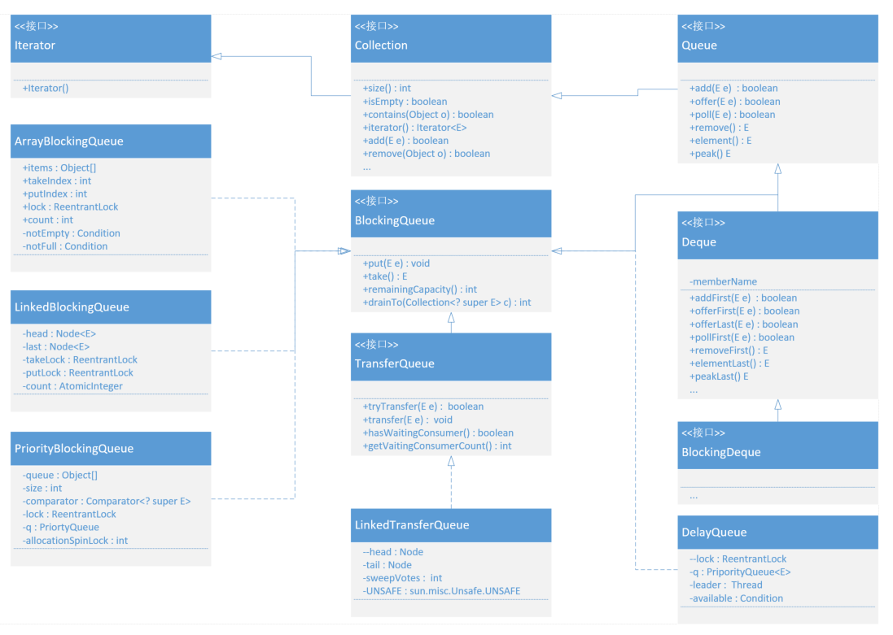
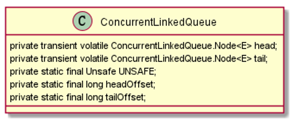
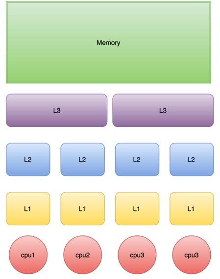
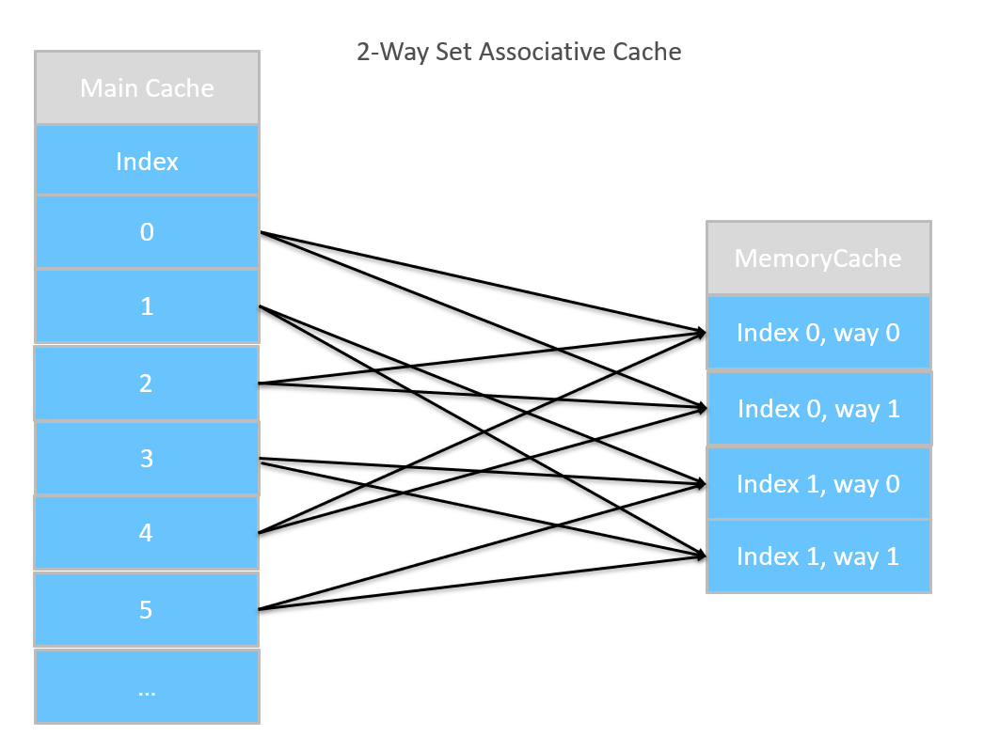
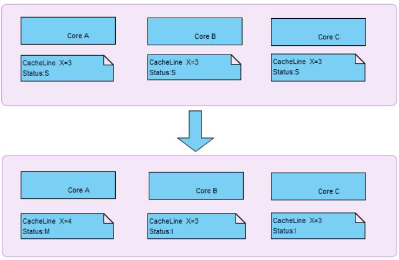

# 队列
---
## 一 java内置队列
|队列|有界性|锁|数据结构|
|:-|:-|:-|:-|
|ArrayBlockingQueue|bounded|加锁|arrayList|
|LinkedBlockingQueue|optionally-bounded(在不指定时容量为Integer.MAX_VALUE,可以指定容量)|加锁|linkedList|
|PriorityQueue|unbounded|无锁|heap|
|DelayQueue|unbounded|无锁|heap|
|PriorityBlockingQueue|unbounded(一个由优先级堆支持的无界优先级队列)|无锁|heap|
|SynchronousQueue|bounded(1) 没有缓冲区，生产者和消费者互相等待对方，握手，然后一起离开|加锁|无|
|LinkedTransferQueue|unbounded|无锁|linkedList|
|ConcurrentLinkedQueue|unbounded|无锁|linkedList|

## 二 阻塞队列

### 2.1 SynchronousQueue 
#### 2.1.1 SynchronousQueue介绍
SynchronousQueue，实际上它不是一个真正的队列，因为它不会为队列中元素维护存储空间。与其他队列不同的是，它维护一组线程，这些线程在等待着把元素加入或移出队列， 它阻塞的是加入和移出的线程操作
    
        // 公平模式和不公平模式
        public SynchronousQueue(boolean fair) {
            transferer = fair ? new TransferQueue() : new TransferStack();
        }
        
        // 一个节点即是头节点也是尾节点
        TransferQueue() {
            QNode h = new QNode(null, false); // initialize to dummy node.
            head = h;
            tail = h;
        }
        
        /** Dual stack */
        static final class TransferStack extends Transferer {

            /* Modes for SNodes, ORed together in node fields */
            /** Node represents an unfulfilled consumer */
            static final int REQUEST    = 0;
            /** Node represents an unfulfilled producer */
            static final int DATA       = 1;
            /** Node is fulfilling another unfulfilled DATA or REQUEST */
            static final int FULFILLING = 2;
        
            /** Return true if m has fulfilling bit set */
            static boolean isFulfilling(int m) { return (m & FULFILLING) != 0; }
        
            /** Node class for TransferStacks. */
            static final class SNode {
                volatile SNode next;        // next node in stack
                volatile SNode match;       // the node matched to this
                volatile Thread waiter;     // to control park/unpark
                Object item;                // data; or null for REQUESTs
                int mode;
                // Note: item and mode fields don't need to be volatile
                // since they are always written before, and read after,
                // other volatile/atomic operations.
        
                SNode(Object item) {
                    this.item = item;
                }
        
                boolean casNext(SNode cmp, SNode val) {
                    return cmp == next &&
                        UNSAFE.compareAndSwapObject(this, nextOffset, cmp, val);
                }
            }
        }
        
#### 2.1.2 SynchronousQueue 在线程池中的应用
Executors.newCachedThreadPool()就使用了SynchronousQueue，这个线程池根据需要（新任务到来时）创建新的线程，如果有空闲线程则会重复使用，线程空闲了60秒后会被回收
    
    // 创建newCachedThreadPool线程池使用的消息队列是：SynchronousQueue
    ExecutorService executorService = Executors.newCachedThreadPool();
    // 实现如下
    public static ExecutorService newCachedThreadPool() {
        return new ThreadPoolExecutor(0, Integer.MAX_VALUE, 60L, TimeUnit.SECONDS, new SynchronousQueue<Runnable>());
    }
    
### 2.2 LinkedBlockingQueue
    // LinkedBlockingQueue:线程池Executors的newFixedThreadPool和newSingleThreadExecutor的工作队列
    public static BlockingQueue<Runnable> buildQueue(int size, boolean isPriority) {
        Object queue;
        if (size == 0) {
        	queue = new SynchronousQueue();  
        } else if (isPriority) {       
        	queue = size < 0 ? new PriorityBlockingQueue() : new PriorityBlockingQueue(size);    
        } else {   
        	queue = size < 0 ? new LinkedBlockingQueue() : new LinkedBlockingQueue(size);
        }
        return (BlockingQueue)queue;
    }
    
### 2.3 ArrayBlockingQueued
 
 如上图ArrayBlockingQueued的生产-消费过程，ArrayBlockingQueue的读写是不同步的，读会修改takeIndex，写会改putIndex 
### 2.4 LinkedTransferQueue
#### 2.4.1 LinkedTransferQueue 实现 TransferQueue 接口
TransferQueue接口方法

    // 若当前存在一个正在等待获取的消费者线程，即立刻移交之；否则，会插入当前元素e到队列尾部，并且等待进入阻塞状态，到有消费者线程取走该元素
    transfer(E e);
    // 若当前存在一个正在等待获取的消费者线程（使用take()或者poll()函数），使用该方法会即刻转移/传输对象元素e；若不存在，则返回false，并且不进入队列。这是一个不阻塞的操作
    tryTransfer(E e);
    // 若当前存在一个正在等待获取的消费者线程，会立即传输给它;否则将插入元素e到队列尾部，并且等待被消费者线程获取消费掉；若在指定的时间内元素e无法被消费者线程获取，则返回false，同时该元素被移除。
    tryTransfer(E e, long timeout, TimeUnit unit);
    // 判断是否存在消费者线程
    hasWaitingConsumer();
    // 获取所有等待获取元素的消费线程数量
    getWaitingConsumerCount();
    // 因为队列的异步特性，检测当前队列的元素个数需要逐一迭代，可能会得到一个不太准确的结果，尤其是在遍历时有可能队列发生更改
    size()
    
#### 2.4.2 transfer算法    
transfer算法比较复杂，大致的理解是采用所谓双重数据结构(dual data structures)。之所以叫双重，其原因是方法都是通过两个步骤完成：保留与完成。比如消费者线程从一个队列中取元素，发现队列为空，他就生成一个空元素放入队列,所谓空元素就是数据项字段为空。然后消费者线程在这个字段上旅转等待。这叫保留。直到一个生产者线程意欲向队例中放入一个元素，这里他发现最前面的元素的数据项字段为NULL，他就直接把自已数据填充到这个元素中，即完成了元素的传送。
#### 2.4.3 注意事项
|注意事项|
|:-|
|(1)无论是transfer还是tryTransfer方法，在>=1个消费者线程等待获取元素时（此时队列为空），都会立刻转交，这属于线程之间的元素交换。注意，这时，元素并没有进入队列|
|(2)在队列中已有数据情况下，transfer将需要等待前面数据被消费掉，直到传递的元素e被消费线程取走为止|
|(3)使用transfer方法，工作者线程可能会被阻塞到生产的元素被消费掉为止|
|(4)消费者线程等待为零的情况下，各自的处理元素入队与否情况有所不同|
|(5)size()方法，需要迭代，可能不太准确，尽量不要调用|

## 三 非阻塞队列
### 3.1 ConcurrentLinkedQueue

### 3.2 环形队列
#### 3.2.1 环形队列优点
|优点|描述|
|:-|:-|
|保证元素是先进先出的|是由队列的性质保证的，在环形队列中通过对队列的顺序访问保证|
|元素空间可以重复利用|因为一般的环形队列都是一个元素数固定的一个闭环，可以在环形队列初始化的时候分配好确定的内存空间，当进队或出队时只需要返回指定元素内存空间的地址即可，这些内存空间可以重复利用，避免频繁内存分配和释放的开销|
|为多线程数据通信提供了一种高效的机制|在最典型的生产者消费者模型中，如果引入环形队列，那么生成者只需要生成“东西”然后放到环形队列中即可，而消费者只需要从环形队列里取“东西”并且消费即可，没有任何锁或者等待，巧妙的高效实现了多线程数据通信|
#### 3.2.2 无锁环形队列的实现

|实现方式|描述|
|:-|:-|
|环形队列的存储结构|链表和线性表都是可以的，但几乎都用线性表实现，比链表快很多，原因也是显而易见的，因为访问链表需要挨个遍历|
|读写index|有2个index很重要，一个是写入index，标示了当前可以写入元素的index，入队时使用。一个是读取index，标示了当前可以读取元素的index，出队时使用|
|元素状态切换|有种很巧妙的方法，就是在队列中每个元素的头部加一个元素标示字段，标示这个元素是可读还是可写，而这个的关键就在于何时设置元素的可读可写状态，参照linux内核实现原理，当这个元素读取完之后，要设置可写状态，当这个元素写入完成之后，要设置可读状态|
## 四 伪共享
### 4.1 什么是伪共享
CPU缓存系统中是以缓存行（cache line）为单位存储的。目前主流的CPU Cache的Cache Line大小都是64Bytes。
在多线程情况下，如果需要修改“共享同一个缓存行的变量”，就会无意中影响彼此的性能，这就是伪共享（False Sharing）。
### 4.2 cpu三级缓存结构 
由于CPU的速度远远大于内存速度，所以CPU设计者们就给CPU加上了缓存(CPU Cache)。 以免运算被内存速度拖累。（就像我们写代码把共享数据做Cache不想被DB存取速度拖累一样），CPU Cache分成了三个级别：L1，L2，L3。越靠近CPU的缓存越快也越小。所以L1缓存很小但很快，并且紧靠着在使用它的CPU内核。L2大一些，也慢一些，并且仍然只能被一个单独的 CPU 核使用。L3在现代多核机器中更普遍，仍然更大，更慢，并且被单个插槽上的所有 CPU 核共享。最后，你拥有一块主存，由全部插槽上的所有 CPU 核共享。
当CPU执行运算的时候，它先去L1查找所需的数据，再去L2，然后是L3，最后如果这些缓存中都没有，所需的数据就要去主内存拿。走得越远，运算耗费的时间就越长。所以如果你在做一些很频繁的事，你要确保数据在L1缓存中。 

### 4.3 缓存行
由于共享变量在CPU缓存中的存储是以缓存行为单位，一个缓存行可以存储多个变量（存满当前缓存行的字节数）；而CPU对缓存的修改又是以缓存行为最小单位的，那么就会出现上诉的伪共享问题。
Cache Line可以简单的理解为CPU Cache中的最小缓存单位，今天的CPU不再是按字节访问内存，而是以64字节为单位的块(chunk)拿取，称为一个缓存行(cache line)。当你读一个特定的内存地址，整个缓存行将从主存换入缓存，并且访问同一个缓存行内的其它值的开销是很小的。
### 4.4 缓存关联性!
目前常用的缓存设计是N路组关联(N-Way Set Associative Cache)，他的原理是把一个缓存按照N个Cache Line作为一组（Set），缓存按组划为等分。每个内存块能够被映射到相对应的set中的任意一个缓存行中。比如一个16路缓存，16个Cache Line作为一个Set，每个内存块能够被映射到相对应的Set 
中的16个CacheLine中的任意一个。一般地，具有一定相同低bit位地址的内存块将共享同一个Set。 
下图为一个2-Way的Cache。由图中可以看到Main Memory中的Index0,2,4都映射在Way0的不同CacheLine中，Index1,3,5都映射在Way1的不同CacheLine中。

### 4.5 MESI协议
#### 多核CPU都有自己的专有缓存（一般为L1，L2），以及同一个CPU插槽之间的核共享的缓存（一般为L3）。不同核心的CPU缓存中难免会加载同样的数据，那么如何保证数据的一致性呢，就是MESI协议了。 在MESI协议中，每个Cache line有4个状态，可用2个bit表示，如下表格
|状态|描述|
|:-|:-| 
|M(Modified)|这行数据有效，数据被修改了，和内存中的数据不一致，数据只存在于本Cache中| 
|E(Exclusive)|这行数据有效，数据和内存中的数据一致，数据只存在于本Cache中| 
|S(Shared)|这行数据有效，数据和内存中的数据一致，数据存在于很多Cache中| 
|I(Invalid)|这行数据无效| 
#### 那么，假设有一个变量i=3（应该是包括变量i的缓存块，块大小为缓存行大小）；已经加载到多核（a,b,c）的缓存中，此时该缓存行的状态为S；此时其中的一个核a改变了变量i的值，那么在核a中的当前缓存行的状态将变为M，b,c核中的当前缓存行状态将变为I。如下图： 

## 五 如何解决伪共享
### 5.1 解决原理 
为了避免由于false sharing 导致CacheLine从L1,L2,L3到主存之间重复载入，我们可以使用数据填充的方式来避免，即单个数据填充满一个CacheLine。这本质是一种空间换时间的做法。
### 5.2 Java对于伪共享的传统解决方案
     
     import java.util.concurrent.atomic.AtomicLong;
     public final class FalseSharing implements Runnable {
         public final static int NUM_THREADS = 4; // change
         public final static long ITERATIONS = 500L * 1000L * 1000L;
         private final int arrayIndex;
         private static VolatileLong[] longs = new VolatileLong[NUM_THREADS];
         static {
             for (int i = 0; i < longs.length; i++) {
                 longs[i] = new VolatileLong();
             }
         }
         public FalseSharing(final int arrayIndex) {
             this.arrayIndex = arrayIndex;
         }
         public static void main(final String[] args) throws Exception {
             final long start = System.nanoTime();
             runTest();
             System.out.println("duration = " + (System.nanoTime() - start));
         }
         private static void runTest() throws InterruptedException {
             Thread[] threads = new Thread[NUM_THREADS];
             for (int i = 0; i < threads.length; i++) {
                 threads[i] = new Thread(new FalseSharing(i));
             }
             for (Thread t : threads) {
                 t.start();
             }
             for (Thread t : threads) {
                 t.join();
             }
         }
         public void run() {
             long i = ITERATIONS + 1;
             while (0 != --i){
                 longs[arrayIndex].set(i);
             }
         }
         public static long sumPaddingToPreventOptimisation(final int index) {
             VolatileLong v = longs[index];
             return v.p1 + v.p2 + v.p3 + v.p4 + v.p5 + v.p6;
         }
         //jdk7以上使用此方法(jdk7的某个版本oracle对伪共享做了优化)
         public final static class VolatileLong {
             public volatile long value = 0L;
             public long p1, p2, p3, p4, p5, p6;
         }
         // jdk7以下使用此方法
         public final static class VolatileLong {
             public long p1, p2, p3, p4, p5, p6, p7; // cache line padding
             public volatile long value = 0L;
             public long p8, p9, p10, p11, p12, p13, p14; // cache line padding
         }
     }
### 5.3 Java8中的解决方案
Java8中已经提供了官方的解决方案，Java8中新增了一个注解：@sun.misc.Contended。加上这个注解的类会自动补齐缓存行，需要注意的是此注解默认是无效的，需要在jvm启动时设置-XX:-RestrictContended才会生效
    
    @sun.misc.Contended
    public final static class VolatileLong {
        public volatile long value = 0L;
        //public long p1, p2, p3, p4, p5, p6;
    }
## 六 Disruptor
### 6.1 Disruptor
Disruptor是英国外汇交易公司LMAX开发的一个高性能队列，研发的初衷是解决内存队列的延迟问题（在性能测试中发现竟然与I/O操作处于同样的数量级）。
基于Disruptor开发的系统单线程能支撑每秒600万订单，2010年在QCon演讲后，获得了业界关注。2011年，企业应用软件专家Martin Fowler专门撰写长文介绍。
同年它还获得了Oracle官方的Duke大奖。目前，包括Apache Storm、Camel、Log4j 2在内的很多知名项目都应用了Disruptor以获取高性能
### 6.2 Disruptor通过以下设计来解决队列速度慢的问题：
|:-|
|(1)环形数组结构|
|(2)元素位置定位：数组长度2^n，通过位运算，加快定位的速度|
|(3)基于缓存行的无锁设计|
### 6.3 如何解决伪共享

