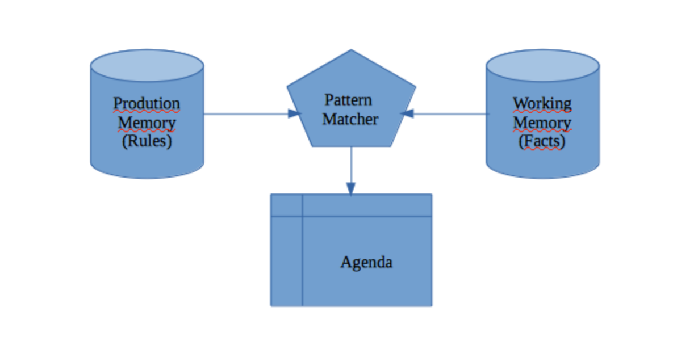

# 规则引擎
---
## 一可以被封装成规则引擎的脚本语言 

### 1.1 QLExpress([文档连接](https://github.com/alibaba/QLExpress))
QLExpress是一个由阿里开源的轻量级的类java语法规则引擎，作为一个嵌入式规则引擎在业务系统中使用。让业务规则定义简便而不失灵活。让业务人员就可以定义业务规则。支持标准的JAVA语法，还可以支持自定义操作符号、操作符号重载、函数定义、宏定义、数据延迟加载等

### 1.2 Groovy
Groovy是一种动态语言，它和Java类似（具备脚本语言的特点），都在Java虚拟机中运行。当运行Groovy脚本时它会先被编译成Java类字节码，然后通过JVM虚拟机执行这个Java字节码类 
直接在groovy脚本中可以写完整的Java代码逻辑，兼容很好
### 1.3 QLExpress与Groovy比较
qlExpress和groovy同属脚本语言，比较如下：
#### 1.3.1 groovy比qlExpress更兼容java语法
相对功能复杂处理过程的大段java脚本，groovy可以直接拷贝过来运行，
而qlexpress的语法很轻量，对原始的java代码有一定的兼容性问题，一般需要把数据的类型声明全部去掉，同时不支持异常处理、for循环的集合写法 等
#### 1.3.2 qlExpress比groovy更强调功能扩展
因为qlExpress就是诞生于阿里的电商系统，定制了很多特别的常用功能需求（宏定义，语法解析，公式计算，布尔逻辑处理，操作符函数的内置替换），可读性和功能更贴合业务需要，详细看qlExpress的扩展能力部分
#### 1.3.3 qlExpress和groovy性能相当
qlExpress和groovy同属弱类型语法，比如a+b，可以在运行时支持字符串，数字等多种计算模式，相比fel，simpleExpress 等强类型语言性能会差一个数量级。
他们都支持编译期做了缓存功能，qlExpress转化为InstructSet，groovy转化为一个特殊的groovyclass子类
## 二 Drools
Drools是最活跃的开源规则引擎。基于Drools的XML框架 + Java/Groovy/Python嵌入语言，专注于规则的条件匹配和执行

### 2.1 语言规则
    rule “name”
        attributes ---->属性
        when
            LHS ---->条件
        then
            RHS	---->结果
    end
### 2.2 and & or & Object
    rule "infixAnd"
        when
          ( $c1 : Customer ( country=="GB") and  PrivateAccount(  owner==$c1))
                or
           ( $c1 : Customer (country=="US") and PrivateAccount(  owner==$c1))
        then
            showResult.showText("Person lives in GB or US");
    end
  
  
  

qlExpress本身只是一个脚本语言，可以被封装成规则引擎，而drools本身是个规则引擎，专注于规则的条件匹配和执行，不具备可比性。

