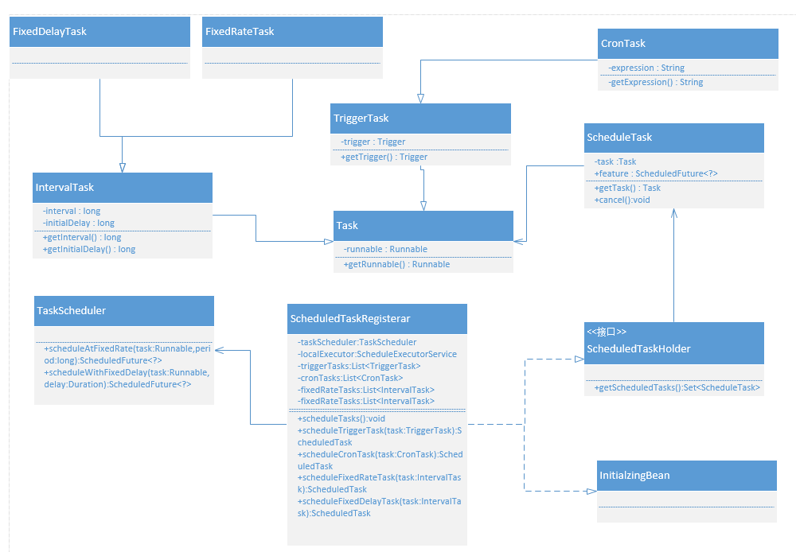
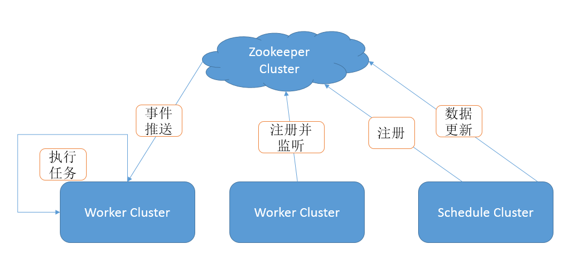

# 任务调度
---
## 一 Timer
    private static Timer timer = new Timer();
    public static void main(String[] args) throws Exception {
        timer.schedule(new TimerTask(){
            public void run() {
                System.out.println("Timer");
            }
        }, 0, 500);
        Thread.sleep(5000);
        timer.schedule(new TimerTask(){
            public void run(){
                throw new RuntimeException();
            }
        }, 0,1000);
    }
|问题|
|:-| 
|(1)Timer对调度的支持是基于绝对时间,而不是相对时间的，因此任务对系统时钟的改变是敏感的|
|(2)一个Timer中的不同任务线程隔离不好，一旦其中有一个线程异常，所有的调度任务都结束|
## 二 ScheduledExecutorService
    public static void main(String[] args) {
        final ScheduledExecutorService scheduledExecutorService = new ScheduledThreadPoolExecutor(1);
        scheduledExecutorService.scheduleAtFixedRate(
                () -> System.out.println("ScheduledExecutorService"),
                0,
                1,
                TimeUnit.SECONDS);
    }
|与Timer对比的优点|
|:-| 
|(1)支持相对时间|
|(2)基于 ScheduledThreadPoolExecutor 隔离不同任务|
## 三 spring schedule
### 3.1 spring schedule使用
    @Component
    public class ScheduleJob {
     
        @Scheduled(cron = "0 */1 * * * ?")
        public void fixedRateJob() {
            System.out.println("spring schedule");
        }
     
    }
spring Schedule基于注解使用很简单如上代码使用cron表达式控制执行间隔，被注解的方法是具体任务类
### 3.2 spring schedule实现
（1）ScheduledAnnotationBeanPostProcessor实现ApplicationListener<ContextRefreshedEvent> 
（2）在bean初始化的时候进行监听onApplicationEvent(ContextRefreshedEvent event) 
（3）onApplicationEvent方法中调用 finishRegistration()方法，在方法中调用ScheduleTaskRegisterar进行任务调度（scheduleAtFixedRate或scheduleWithFixedDelay） 
ScheduleTaskRegister的实现逻辑如下图

## 四 quartz
### 4.1 quartz使用
Quartz是一个完全由java编写的开源作业调度框架

    public static void main(String[] args) throws SchedulerException, InterruptedException {
        Scheduler scheduler = StdSchedulerFactory.getDefaultScheduler();
        Trigger trigger = cronSchedule("0 0/2 8-17 * * ?").build();
        JobDetail job = newJob(HelloQuartz.class)
                //定义name/group
                .withIdentity("job1", "group1")
                //定义属性
                .usingJobData("name", "quartz")
                .build();
        scheduler.scheduleJob(job, trigger);
        scheduler.start();
        Thread.sleep(10000);
        scheduler.shutdown(true);
    }
    
|quartz调度过程构成部分|描述|
|:-|:-|
|Scheduler|调度器，所有的调度都是由它控制|
|Trigger|定义触发的条件（支持复杂的条件比如cron表达式）|
|JobDetail & Job|JobDetail 定义任务数据，执行逻辑是在Job中，JobDetail & Job 方式，sheduler每次执行，根据JobDetail创建一个新的Job实例，避免直接使用Job并发访问的问题|
### 4.2 quartz实现
quartz的任务调度最底层是基于多线程实现的，在QuartzScheduler的构造方法中初始化QuartzSchedulerThread并把它放到线程池中执行，QuartzSchedulerThread 的run()方法代码节选如下

    public class QuartzSchedulerThread extends Thread {
        private QuartzScheduler qs;
        private QuartzSchedulerResources qsRsrcs;
        // 锁对象
        private final Object sigLock = new Object();
        private boolean signaled;
        private long signaledNextFireTime;
        private boolean paused;
        // 线程停止标识
        private AtomicBoolean halted;
        private Random random = new Random(System.currentTimeMillis());
        // When the scheduler finds there is no current trigger to fire, how long
        // it should wait until checking again...
        private static long DEFAULT_IDLE_WAIT_TIME = 30L * 1000L;
        private long idleWaitTime = DEFAULT_IDLE_WAIT_TIME;
        private int idleWaitVariablness = 7 * 1000;
        private final Logger log = LoggerFactory.getLogger(getClass());
         
        @Override
        public void run() {
            while (!halted.get()) {
                try {
                    int availThreadCount = qsRsrcs.getThreadPool().blockForAvailableThreads();
                    if(availThreadCount > 0) { // will always be true, due to semantics of blockForAvailableThreads...
                        try {
                            triggers = qsRsrcs.getJobStore().acquireNextTriggers(now + idleWaitTime, Math.min(availThreadCount, qsRsrcs.getMaxBatchSize()), qsRsrcs.getBatchTimeWindow());
                        } catch (JobPersistenceException jpe) { }
                        if (triggers != null && !triggers.isEmpty()) {
                            now = System.currentTimeMillis();
                            long triggerTime = triggers.get(0).getNextFireTime().getTime();
                            long timeUntilTrigger = triggerTime - now;
                            while(timeUntilTrigger > 2) {
                                synchronized (sigLock) {
                                    if (halted.get()) {
                                        break;
                                    }
                                    if (!isCandidateNewTimeEarlierWithinReason(triggerTime, false)) {
                                        try {
                                            // we could have blocked a long while then on 'synchronize', so we must recompute
                                            now = System.currentTimeMillis();
                                            timeUntilTrigger = triggerTime - now;
                                            if(timeUntilTrigger >= 1)
                                                sigLock.wait(timeUntilTrigger);
                                        } catch (InterruptedException ignore) {
                                        }
                                    }
                                }
                            }
                            // 执行调用job逻辑
                            // ...
                        }
                    } else { // if(availThreadCount > 0)
                        continue; // while (!halted)
                    }
                } catch(RuntimeException re) {
                    getLog().error("Runtime error occurred in main trigger firing loop.", re);
                }
            }
        }
sigLock是线程的锁对象，用锁对象的wait()方法控制具体任务的执行时间间隔
### 4.3 缺点
|缺点|
|:-|
|(1)quartz是支持分布式定时任务的，但是它是基于数据库的分布式锁机制来保证一次只有一个线程来操作：加锁  > 操作 > 释放锁。数据库的行锁是一种悲观锁，锁表时其他线程无法查询，因此，如果加锁后进行的操作时间过长，会带来集群间主线程等待的问题|
|(2)尽管quartz能够基于数据库实现作业的高可用，但是由于抢占式执行的模式，不支持分布式并行运行作业的功能|

## 五 tbsSchedule
### 5.1 tbsSchedule
### 5.1.1 设计目的
|设计目的|
|:-|
|(1)让批量任务或者不断变化的任务，能够被动态的分配到多个主机的JVM中，不同的线程组中并行执行|
|(2)所有的任务能够被不重复，不遗漏的快速处理|
|(3)任务处理服务期可以动态的增加和减少|
|(4)可以通过域来隔离不同的执行环境|
|(5)可以任意指定调度的时间区间|
|(6)可以通过JMX控制调度服务的创建和停止|
### 5.1.2 整体架构
tbschedule框架item的分配实现了数据的不重复，又通过架构中lead的选择，存活的自我保证，完成了可用性和伸缩性的保障。Tbschedule是一个完全基于分布式调度的框架，整体结构如下图

 
执行机和调度机均以ZooKeeper为注册中心，所有数据以节点及节点内容的形式注册，通过定时汇报主机状态保持存活在ZooKeeper上。执行机部署启动，会在ZooKeeper上创建永久根节点schedule.zookeeper.address，其后所有的操作均在该根节点下进行。
### 5.2 Tbschedule基于Timer实现任务调度

    class PauseOrResumeScheduleTask extends java.util.TimerTask {
        public void run() {
            try {
                Thread.currentThread().setPriority(Thread.MAX_PRIORITY);
                this.cancel();//取消调度任务
                Date current = new Date(System.currentTimeMillis());
                CronExpression cexp = new CronExpression(this.cronTabExpress);
                Date nextTime = cexp.getNextValidTimeAfter(current);
                if (this.type == TYPE_PAUSE) {
                    manager.pause("到达终止时间,pause调度");
                    this.manager.getScheduleServer().setNextRunEndTime(
                            ScheduleUtil.transferDataToString(nextTime));
                } else {
                    manager.resume("到达开始时间,resume调度");
                    this.manager.getScheduleServer().setNextRunStartTime(
                            ScheduleUtil.transferDataToString(nextTime));
                }
                this.timer.schedule(new PauseOrResumeScheduleTask(this.manager,
                        this.timer, this.type, this.cronTabExpress), nextTime);
            } catch (Throwable ex) {
                log.error(ex.getMessage(), ex);
            }
        }
        ...
    }

### 5.3 TBschedule的概念
#### 5.3.1 TBScheduleManager
##### 5.3.1.1 TBScheduleManager任务调度分配器目标
|TBScheduleManager任务调度分配器目标|
|:-|
|(1)调度的Manager可以动态的随意增加和停止|
|(2)让所有的任务不重复，不遗漏的被快速处理|
|(3)在不同的JVM里面可以存在处理相同任务的Manager|
|(4)在一个JVM里面可能存在多个处理相同任务类型的Manager，也可能存在处理不同任务类型的Manager|
|(5)一个Manager只管理一种任务类型的一组工作线程|
##### 5.3.1.1 TBScheduleManager主要职责
|TBScheduleManager主要职责|
|:-|
|(1)定时向集中的数据配置中心更新当前调度服务器的心跳状态|
|(2)向数据配置中心获取所有服务器的状态来重新计算任务的分配。这么做的目标是避免集中任务调度中心的单点问题|
|(3)在每个批次数据处理完毕后，检查是否有其它处理服务器申请自己把持的任务队列，如果有，则释放给相关处理服务器|
|(4)如果当前服务器在处理当前任务的时候超时，需要清除当前队列，并释放已经把持的任务。并向控制主动中心报警|
#### 5.3.2 scheduleTaskType
保存执行任务bean和执行参数信息
#### 5.3.3 ScheduleStrategy
 任务的调度策略，指定要执行此任务的节点数，执行任务的节点ip列表
#### 5.3.4 ITScheduleProcessor
在TBScheduleManager的管理下实现消费线程的多线程协同处理，是由一组线程【1..n个线程】构成的任务处理单元，每一任务处理器有一个唯一的全局标识， 一般以IP$UUID[例如192.168.1.100$0C78F0C0FA084E54B6665F4D00FA73DC]的形式出现。 
一个任务类型的数据可以由1..n个任务处理器同时进行。这些任务处理器可以在同一个JVM中，也可以分布在不同主机的JVM中。任务处理器内部有一个心跳线程，用于确定Server的状态和任务的动态分配， 有一组工作线程，负责处理查询任务和具体的任务处理工作。
#### 5.3.5 ITScheduleTaskDeal
任务处理的最小单元包括任务的查询和处理，由ITScheduleProcessor调用线程组空闲的一个线程方法selectTasks获取到需要消费的任务列表。然后所有线程根据领用消费方式处理列表中任务

### 5.4 使用

    public class TbscheduleJob implements IScheduleTaskDealSingle<String> {
        @Override
        public boolean execute(String task, String ownSign) throws Exception {
            // do something
            return true;
        }
        @Override
        public List<String> selectTasks(String taskParameter, String ownSign, int taskItemNum, List<TaskItemDefine> taskItemList, int eachFetchDataNum) throws Exception {
            // fetch Data
            return null;
        }
        @Override
        public Comparator<String> getComparator() {
            return null;
        }
    }

### 5.5 优点
|优点|
|:-|
|(1)支持集群、分布式|
|(2)灵活的任务分片|
|(3)动态的服务扩容和资源回收|
|(4)任务监控支持|
|(5)稳定性很好|
由于Tbschedule的实现和Elastic job很多类似，所以不详细介绍实现细节

## 六 elasticJob