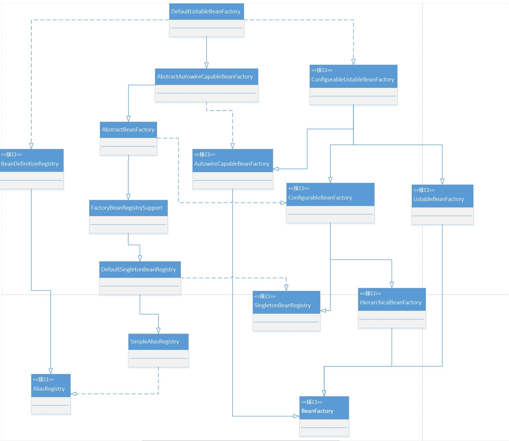

# BeanFactory
--
### 一 DefaultListableBeanFactory

```java
public class BeanFactoryTest {

    @Test
    public void testSimpleLoad() {
        BeanFactory beanFactory = new XmlBeanFactory(new ClassPathResource("beanFactory.xml"));
        CustomBean customBean = (CustomBean) beanFactory.getBean("customBean");
    }
}
```
XmlBeanFactory在Spring 3.1版本弃用
```java
 /* @see org.springframework.beans.factory.support.DefaultListableBeanFactory
  * @see XmlBeanDefinitionReader
  * @deprecated as of Spring 3.1 in favor of {@link DefaultListableBeanFactory} and
  * {@link XmlBeanDefinitionReader}
  */
 @Deprecated
 @SuppressWarnings({"serial", "all"})
 public class XmlBeanFactory extends DefaultListableBeanFactory {
     
 }
```

DefaultListableBeanFactory是XmlBeanFactory加载Bean的核心，DefaultListableBeanFactory的层次结构图如下


- AliasRegistry : 定义对Alias简单的增删改查操作
    ```java
    public interface AliasRegistry {  
        /**
         * Given a name, register an alias for it.
         */
        void registerAlias(String name, String alias);  
        /**
         * Remove the specified alias from this registry.
         */
        void removeAlias(String alias);  
        /**
         * Determine whether this given name is defines as an alias
         * (as opposed to the name of an actually registered component).
         */
        boolean isAlias(String name);  
        /**
         * Return the aliases for the given name, if defined.
         */
        String[] getAliases(String name);  
    }
    ```
- SimpleAliasRegistry : 以map作为alias的缓存，并对AliasRegistry进行实现
    ```java
    public class SimpleAliasRegistry implements AliasRegistry {  
        /** Map from alias to canonical name. */
        private final Map<String, String> aliasMap = new ConcurrentHashMap<>(16);  
    }
    ```
- SingletonBeanRegistry : 定义对Singleton的注册及获取
    ```java
    public interface SingletonBeanRegistry {  
        /**
         * Register the given existing object as singleton in the bean registry,
         * under the given bean name.
          */
        void registerSingleton(String beanName, Object singletonObject);  
        /**
         * Return the (raw) singleton object registered under the given name.
         */
        @Nullable
        Object getSingleton(String beanName);  
        /**
         * Check if this registry contains a singleton instance with the given name.
         */
        boolean containsSingleton(String beanName);  
        /**
         * Return the names of singleton beans registered in this registry.
         */
        String[] getSingletonNames();  
        /**
         * Return the number of singleton beans registered in this registry.
         */
        int getSingletonCount();  
        /**
         * Return the singleton mutex used by this registry (for external collaborators).
         */
        Object getSingletonMutex();  
    }
    ```    
- DefaultSingletonBeanRegistry : 继承SimpleAliasRegistry并对SingletonBeanRegistry进行实现
    ```java
    public class DefaultSingletonBeanRegistry extends SimpleAliasRegistry implements SingletonBeanRegistry {  
        /** Cache of singleton objects: bean name to bean instance. */
        private final Map<String, Object> singletonObjects = new ConcurrentHashMap<>(256);  
        /** Cache of singleton factories: bean name to ObjectFactory. */
        private final Map<String, ObjectFactory<?>> singletonFactories = new HashMap<>(16);  
        /** Cache of early singleton objects: bean name to bean instance. */
        private final Map<String, Object> earlySingletonObjects = new HashMap<>(16);  
        /** Set of registered singletons, containing the bean names in registration order. */
        private final Set<String> registeredSingletons = new LinkedHashSet<>(256);  
        /** Names of beans that are currently in creation. */
        private final Set<String> singletonsCurrentlyInCreation =
                Collections.newSetFromMap(new ConcurrentHashMap<>(16));  
        /** Names of beans currently excluded from in creation checks. */
        private final Set<String> inCreationCheckExclusions =
                Collections.newSetFromMap(new ConcurrentHashMap<>(16));  
        /** List of suppressed Exceptions, available for associating related causes. */
        private Set<Exception> suppressedExceptions;  
        /** Flag that indicates whether we're currently within destroySingletons. */
        private boolean singletonsCurrentlyInDestruction = false;  
        /** Disposable bean instances: bean name to disposable instance. */
        private final Map<String, Object> disposableBeans = new LinkedHashMap<>();  
        /** Map between containing bean names: bean name to Set of bean names that the bean contains. */
        private final Map<String, Set<String>> containedBeanMap = new ConcurrentHashMap<>(16);  
        /** Map between dependent bean names: bean name to Set of dependent bean names. */
        private final Map<String, Set<String>> dependentBeanMap = new ConcurrentHashMap<>(64);  
        /** Map between depending bean names: bean name to Set of bean names for the bean's dependencies. */
        private final Map<String, Set<String>> dependenciesForBeanMap = new ConcurrentHashMap<>(64);  
    }
    ```    
- FactoryBeanRegistrySupport : 在DefaultSingletonBeanRegistry的基础上增加了对FactoryBean的特殊处理 
    ```java
    /**
     * Support base class for singleton registries which need to handle FactoryBean instances
     * integrated with DefaultSingletonBeanRegistry's singleton management.
     */
    public abstract class FactoryBeanRegistrySupport extends DefaultSingletonBeanRegistry {}
    ``` 
- BeanDefinitionRegistry : 定义对BeanDefine的各种增删改查操作
    ```java
    public interface BeanDefinitionRegistry extends AliasRegistry {
    
        /**
         * Register a new bean definition with this registry.
         * Must support RootBeanDefinition and ChildBeanDefinition.
         */
        void registerBeanDefinition(String beanName, BeanDefinition beanDefinition)
                throws BeanDefinitionStoreException;
    
        /**
         * Remove the BeanDefinition for the given name.
         */
        void removeBeanDefinition(String beanName) throws NoSuchBeanDefinitionException;
    
        /**
         * Return the BeanDefinition for the given bean name.
         */
        BeanDefinition getBeanDefinition(String beanName) throws NoSuchBeanDefinitionException;
    
        /**
         * Check if this registry contains a bean definition with the given name.
         */
        boolean containsBeanDefinition(String beanName);
    
        /**
         * Return the names of all beans defined in this registry.
         */
        String[] getBeanDefinitionNames();
    
        /**
         * Return the number of beans defined in the registry.
         */
        int getBeanDefinitionCount();
    
        /**
         * Determine whether the given bean name is already in use within this registry,
         * i.e. whether there is a local bean or alias registered under this name.
         */
        boolean isBeanNameInUse(String beanName);
    
    }
    ```    
- BeanFactory : 定义获取bean及bean相关基础方法
    ```java
    public interface BeanFactory {
    
        /**
         * Return an instance, which may be shared or independent, of the specified bean.
         */
        Object getBean(String name) throws BeansException;
    
        <T> T getBean(String name, Class<T> requiredType) throws BeansException;
    
        Object getBean(String name, Object... args) throws BeansException;
    
        /**
         * Return the bean instance that uniquely matches the given object type, if any.
         */
        <T> T getBean(Class<T> requiredType) throws BeansException;
    
        /**
         * Return an instance, which may be shared or independent, of the specified bean.
         */
        <T> T getBean(Class<T> requiredType, Object... args) throws BeansException;
    
        /**
         * Return an provider for the specified bean, allowing for lazy on-demand retrieval
         * of instances, including availability and uniqueness options.
        <T> ObjectProvider<T> getBeanProvider(Class<T> requiredType);
    
        /**
         * Return an provider for the specified bean, allowing for lazy on-demand retrieval
         * of instances, including availability and uniqueness options.
         */
        <T> ObjectProvider<T> getBeanProvider(ResolvableType requiredType);
    
        /**
         * Does this bean factory contain a bean definition or externally registered singleton
         * instance with the given name?
         */
        boolean containsBean(String name);
    
        /**
         * Is this bean a shared singleton? That is, will {@link #getBean} always
         * return the same instance?
         */
        boolean isSingleton(String name) throws NoSuchBeanDefinitionException;
    
        /**
         * Is this bean a prototype? That is, will {@link #getBean} always return
         */
        boolean isPrototype(String name) throws NoSuchBeanDefinitionException;
    
        /**
         * Check whether the bean with the given name matches the specified type.
         */
        boolean isTypeMatch(String name, ResolvableType typeToMatch) throws NoSuchBeanDefinitionException;
    
        /**
         * Check whether the bean with the given name matches the specified type.
         * More specifically, check whether a {@link #getBean} call for the given name
         * would return an object that is assignable to the specified target type.
         */
        boolean isTypeMatch(String name, Class<?> typeToMatch) throws NoSuchBeanDefinitionException;
    
        /**
         * Determine the type of the bean with the given name. More specifically,
         * determine the type of object that {@link #getBean} would return for the given name.
         */
        @Nullable
        Class<?> getType(String name) throws NoSuchBeanDefinitionException;
    
        /**
         * Return the aliases for the given bean name, if any.
         * All of those aliases point to the same bean when used in a {@link #getBean} call.
         */
        String[] getAliases(String name);
    }
    ```
- HierarchicalBeanFactory : 继承BeanFactory，在BeanFactory的基础上添加对ParentFactory的支持
    ```java
    public interface HierarchicalBeanFactory extends BeanFactory {  
        /**
         * Return the parent bean factory, or {@code null} if there is none.
         */
        BeanFactory getParentBeanFactory();  
        /**
         * Return whether the local bean factory contains a bean of the given name,
         * ignoring beans defined in ancestor contexts.
         */
        boolean containsLocalBean(String name);  
    }
    ```
- ConfigurableBeanFactory : 提供配置Factory的各种配置方法
    ```java
    public interface ConfigurableBeanFactory extends HierarchicalBeanFactory, SingletonBeanRegistry {
    
        /**
         * Scope identifier for the standard singleton scope: "singleton".
         */
        String SCOPE_SINGLETON = "singleton";
    
        /**
         * Scope identifier for the standard prototype scope: "prototype".
         */
        String SCOPE_PROTOTYPE = "prototype";
    
    
        /**
         * Set the parent of this bean factory.
         */
        void setParentBeanFactory(BeanFactory parentBeanFactory) throws IllegalStateException;
    
        /**
         * Set the class loader to use for loading bean classes.
         * Default is the thread context class loader.
         */
        void setBeanClassLoader(@Nullable ClassLoader beanClassLoader);
    
        /**
         * Return this factory's class loader for loading bean classes
         */
        ClassLoader getBeanClassLoader();
    
        /**
         * Specify a temporary ClassLoader to use for type matching purposes.
         * Default is none, simply using the standard bean ClassLoader.
         */
        void setTempClassLoader(@Nullable ClassLoader tempClassLoader);
    
        /**
         * Return the temporary ClassLoader to use for type matching purposes,
         */
        ClassLoader getTempClassLoader();
    
        /**
         * Set whether to cache bean metadata such as given bean definitions
         * (in merged fashion) and resolved bean classes. Default is on.
         */
        void setCacheBeanMetadata(boolean cacheBeanMetadata);
    
        /**
         * Return whether to cache bean metadata such as given bean definitions
         * (in merged fashion) and resolved bean classes.
         */
        boolean isCacheBeanMetadata();
    
        /**
         * Specify the resolution strategy for expressions in bean definition values.
         */
        void setBeanExpressionResolver(@Nullable BeanExpressionResolver resolver);
    
        /**
         * Return the resolution strategy for expressions in bean definition values.
         */
        @Nullable
        BeanExpressionResolver getBeanExpressionResolver();
    
        /**
         * Specify a Spring 3.0 ConversionService to use for converting
         * property values, as an alternative to JavaBeans PropertyEditors.
         */
        void setConversionService(@Nullable ConversionService conversionService);
    
        /**
         * Return the associated ConversionService, if any.
         */
        ConversionService getConversionService();
    
        /**
         * Add a PropertyEditorRegistrar to be applied to all bean creation processes.
         */
        void addPropertyEditorRegistrar(PropertyEditorRegistrar registrar);
    
        /**
         * Register the given custom property editor for all properties of the
         * given type. To be invoked during factory configuration.
         */
        void registerCustomEditor(Class<?> requiredType, Class<? extends PropertyEditor> propertyEditorClass);
    
        /**
         * Initialize the given PropertyEditorRegistry with the custom editors
         * that have been registered with this BeanFactory.
         */
        void copyRegisteredEditorsTo(PropertyEditorRegistry registry);
    
        /**
         * Set a custom type converter that this BeanFactory should use for converting
         * bean property values, constructor argument values, etc.
         */
        void setTypeConverter(TypeConverter typeConverter);
    
        /**
         * Obtain a type converter as used by this BeanFactory. This may be a fresh
         * instance for each call, since TypeConverters are usually notthread-safe.
         */
        TypeConverter getTypeConverter();
    
        /**
         * Add a String resolver for embedded values such as annotation attributes.
         */
        void addEmbeddedValueResolver(StringValueResolver valueResolver);
    
        /**
         * Determine whether an embedded value resolver has been registered with this
         * bean factory, to be applied through {@link #resolveEmbeddedValue(String)}.
         */
        boolean hasEmbeddedValueResolver();
    
        /**
         * Resolve the given embedded value, e.g. an annotation attribute.
         */
        String resolveEmbeddedValue(String value);
    
        /**
         * Add a new BeanPostProcessor that will get applied to beans created
         * by this factory. To be invoked during factory configuration.
         */
        void addBeanPostProcessor(BeanPostProcessor beanPostProcessor);
    
        /**
         * Return the current number of registered BeanPostProcessors, if any.
         */
        int getBeanPostProcessorCount();
    
        /**
         * Register the given scope, backed by the given Scope implementation.
         */
        void registerScope(String scopeName, Scope scope);
    
        /**
         * Return the names of all currently registered scopes.
         */
        String[] getRegisteredScopeNames();
    
        /**
         * Return the Scope implementation for the given scope name, if any.
         */
    
        Scope getRegisteredScope(String scopeName);
    
        /**
         * Provides a security access control context relevant to this factory.
         */
        AccessControlContext getAccessControlContext();
    
        /**
         * Copy all relevant configuration from the given other factory.
         */
        void copyConfigurationFrom(ConfigurableBeanFactory otherFactory);
    
        /**
         * Given a bean name, create an alias. We typically use this method to
         * support names that are illegal within XML ids (used for bean names).
         */
        void registerAlias(String beanName, String alias) throws BeanDefinitionStoreException;
    
        /**
         * Resolve all alias target names and aliases registered in this
         * factory, applying the given StringValueResolver to them.
         */
        void resolveAliases(StringValueResolver valueResolver);
    
        /**
         * Return a merged BeanDefinition for the given bean name,
         * merging a child bean definition with its parent if necessary.
         */
        BeanDefinition getMergedBeanDefinition(String beanName) throws NoSuchBeanDefinitionException;
    
        /**
         * Determine whether the bean with the given name is a FactoryBean.
         */
        boolean isFactoryBean(String name) throws NoSuchBeanDefinitionException;
    
        /**
         * Explicitly control the current in-creation status of the specified bean.
         * For container-internal use only.
         */
        void setCurrentlyInCreation(String beanName, boolean inCreation);
    
        /**
         * Determine whether the specified bean is currently in creation.
         */
        boolean isCurrentlyInCreation(String beanName);
    
        /**
         * Register a dependent bean for the given bean,
         * to be destroyed before the given bean is destroyed.
         */
        void registerDependentBean(String beanName, String dependentBeanName);
    
        /**
         * Return the names of all beans which depend on the specified bean, if any.
         */
        String[] getDependentBeans(String beanName);
    
        /**
         * Return the names of all beans that the specified bean depends on, if any.
         */
        String[] getDependenciesForBean(String beanName);
    
        /**
         * Destroy the given bean instance (usually a prototype instance
         * obtained from this factory) according to its bean definition.
         */
        void destroyBean(String beanName, Object beanInstance);
    
        /**
         * Destroy the specified scoped bean in the current target scope, if any.
         */
        void destroyScopedBean(String beanName);
    
        /**
         * Destroy all singleton beans in this factory, including inner beans that have
         * been registered as disposable. To be called on shutdown of a factory.
         */
        void destroySingletons();
    
    }
    
    ```  
- ListableBeanFactory : 根据各种条件获取bean的配置清单
    ```java
    public interface ListableBeanFactory extends BeanFactory {
    
        /**
         * Check if this bean factory contains a bean definition with the given name.
         */
        boolean containsBeanDefinition(String beanName);
    
        /**
         * Return the number of beans defined in the factory.
         */
        int getBeanDefinitionCount();
    
        /**
         * Return the names of all beans defined in this factory.
         */
        String[] getBeanDefinitionNames();
    
        /**
         * Return the names of beans matching the given type (including subclasses),
         * judging from either bean definitions or the value of {@code getObjectType}
        String[] getBeanNamesForType(ResolvableType type);
    
        /**
         * Return the names of beans matching the given type (including subclasses),
         * judging from either bean definitions or the value of {@code getObjectType}
        */
        String[] getBeanNamesForType(@Nullable Class<?> type);
    
        /**
         * Return the names of beans matching the given type (including subclasses),
         * judging from either bean definitions or the value of {@code getObjectType}
         */
        String[] getBeanNamesForType(@Nullable Class<?> type, boolean includeNonSingletons, boolean allowEagerInit);
    
        /**
         * Return the bean instances that match the given object type (including
         * subclasses), judging from either bean definitions or the value of
         */
        <T> Map<String, T> getBeansOfType(@Nullable Class<T> type) throws BeansException;
    
        /**
         * Return the bean instances that match the given object type (including
         * subclasses), judging from either bean definitions or the value of
         */
        <T> Map<String, T> getBeansOfType(@Nullable Class<T> type, boolean includeNonSingletons, boolean allowEagerInit)
                throws BeansException;
    
        /**
         * Find all names of beans whose {@code Class} has the supplied Annotation
         * type, without creating corresponding bean instances yet.
         */
        String[] getBeanNamesForAnnotation(Class<? extends Annotation> annotationType);
    
        /**
         * Find all beans whose {@code Class} has the supplied Annotation type,
         * returning a Map of bean names with corresponding bean instances.
         */
        Map<String, Object> getBeansWithAnnotation(Class<? extends Annotation> annotationType) throws BeansException;
    
        /**
         * Find an Annotation of annotationType on the specified
         * bean, traversing its interfaces and super classes if no annotation can be
         * found on the given class itself.
         */
        @Nullable
        <A extends Annotation> A findAnnotationOnBean(String beanName, Class<A> annotationType)
                throws NoSuchBeanDefinitionException;
    
    }
    ```
- AbstractBeanFactory : 继承FactoryBeanRegistrySupport的注册功能并实现ConfigurableBeanFactory的配置Factory方法
    ```java
    public abstract class AbstractBeanFactory extends FactoryBeanRegistrySupport implements ConfigurableBeanFactory {
    
        /** Parent bean factory, for bean inheritance support. */
        private BeanFactory parentBeanFactory;
    
        /** ClassLoader to resolve bean class names with, if necessary. */
        private ClassLoader beanClassLoader = ClassUtils.getDefaultClassLoader();
    
        /** ClassLoader to temporarily resolve bean class names with, if necessary. */
        private ClassLoader tempClassLoader;
    
        /** Whether to cache bean metadata or rather reobtain it for every access. */
        private boolean cacheBeanMetadata = true;
    
        /** Resolution strategy for expressions in bean definition values. */
        private BeanExpressionResolver beanExpressionResolver;
    
        /** Spring ConversionService to use instead of PropertyEditors. */
        private ConversionService conversionService;
    
        /** Custom PropertyEditorRegistrars to apply to the beans of this factory. */
        private final Set<PropertyEditorRegistrar> propertyEditorRegistrars = new LinkedHashSet<>(4);
    
        /** Custom PropertyEditors to apply to the beans of this factory. */
        private final Map<Class<?>, Class<? extends PropertyEditor>> customEditors = new HashMap<>(4);
    
        /** A custom TypeConverter to use, overriding the default PropertyEditor mechanism. */
        private TypeConverter typeConverter;
    
        /** String resolvers to apply e.g. to annotation attribute values. */
        private final List<StringValueResolver> embeddedValueResolvers = new CopyOnWriteArrayList<>();
    
        /** BeanPostProcessors to apply in createBean. */
        private final List<BeanPostProcessor> beanPostProcessors = new CopyOnWriteArrayList<>();
    
        /** Indicates whether any InstantiationAwareBeanPostProcessors have been registered. */
        private volatile boolean hasInstantiationAwareBeanPostProcessors;
    
        /** Indicates whether any DestructionAwareBeanPostProcessors have been registered. */
        private volatile boolean hasDestructionAwareBeanPostProcessors;
    
        /** Map from scope identifier String to corresponding Scope. */
        private final Map<String, Scope> scopes = new LinkedHashMap<>(8);
    
        /** Security context used when running with a SecurityManager. */
        @Nullable
        private SecurityContextProvider securityContextProvider;
    
        /** Map from bean name to merged RootBeanDefinition. */
        private final Map<String, RootBeanDefinition> mergedBeanDefinitions = new ConcurrentHashMap<>(256);
    
        /** Names of beans that have already been created at least once. */
        private final Set<String> alreadyCreated = Collections.newSetFromMap(new ConcurrentHashMap<>(256));
    
        /** Names of beans that are currently in creation. */
        private final ThreadLocal<Object> prototypesCurrentlyInCreation =
                new NamedThreadLocal<>("Prototype beans currently in creation");
    }    
    ```
- AutowireCapableBeanFactory : 提供创建bean、自动注入、初始化及应用bean的后处理器
    ```java
    public interface AutowireCapableBeanFactory extends BeanFactory {
    
        /**
         * Constant that indicates no externally defined autowiring. 
         */
        int AUTOWIRE_NO = 0;
    
        /**
         * Constant that indicates autowiring bean properties by name
         */
        int AUTOWIRE_BY_NAME = 1;
    
        /**
         * Constant that indicates autowiring bean properties by type
         */
        int AUTOWIRE_BY_TYPE = 2;
    
        /**
         * Constant that indicates autowiring the greediest constructor that
         * can be satisfied (involves resolving the appropriate constructor).
         */
        int AUTOWIRE_CONSTRUCTOR = 3;
    
        /**
         * Constant that indicates determining an appropriate autowire strategy
         * through introspection of the bean class.
         */
        @Deprecated
        int AUTOWIRE_AUTODETECT = 4;
    
        /**
         * Suffix for the "original instance" convention when initializing an existing
         * bean instance: to be appended to the fully-qualified bean class name,
         * e.g. "com.mypackage.MyClass.ORIGINAL", in order to enforce the given instance
         * to be returned, i.e. no proxies etc.
         */
        String ORIGINAL_INSTANCE_SUFFIX = ".ORIGINAL";
    
    
        //-------------------------------------------------------------------------
        // Typical methods for creating and populating external bean instances
        //-------------------------------------------------------------------------
    
        /**
         * Fully create a new bean instance of the given class.
         */
        <T> T createBean(Class<T> beanClass) throws BeansException;
    
        /**
         * Populate the given bean instance through applying after-instantiation callbacks
         * and bean property post-processing (e.g. for annotation-driven injection).
         */
        void autowireBean(Object existingBean) throws BeansException;
    
        /**
         * Configure the given raw bean: autowiring bean properties, applying
         * bean property values, applying factory callbacks such as {@code setBeanName}
         * and {@code setBeanFactory}, and also applying all bean post processors
         * (including ones which might wrap the given raw bean).
         */
        Object configureBean(Object existingBean, String beanName) throws BeansException;
    
    
        //-------------------------------------------------------------------------
        // Specialized methods for fine-grained control over the bean lifecycle
        //-------------------------------------------------------------------------
    
        /**
         * Fully create a new bean instance of the given class with the specified
         * autowire strategy. All constants defined in this interface are supported here.
         */
        Object createBean(Class<?> beanClass, int autowireMode, boolean dependencyCheck) throws BeansException;
    
        /**
         * Instantiate a new bean instance of the given class with the specified autowire
         * strategy. All constants defined in this interface are supported here.
         * Can also be invoked with {@code AUTOWIRE_NO} in order to just apply
         * before-instantiation callbacks (e.g. for annotation-driven injection).
         */
        Object autowire(Class<?> beanClass, int autowireMode, boolean dependencyCheck) throws BeansException;
    
        /**
         * Autowire the bean properties of the given bean instance by name or type.
         * Can also be invoked with {@code AUTOWIRE_NO} in order to just apply
         * after-instantiation callbacks (e.g. for annotation-driven injection).
         */
        void autowireBeanProperties(Object existingBean, int autowireMode, boolean dependencyCheck)
                throws BeansException;
    
        /**
         * Apply the property values of the bean definition with the given name to
         * the given bean instance. The bean definition can either define a fully
         * self-contained bean, reusing its property values, or just property values
         * meant to be used for existing bean instances.
         */
        void applyBeanPropertyValues(Object existingBean, String beanName) throws BeansException;
    
        /**
         * Initialize the given raw bean, applying factory callbacks
         * such as {@code setBeanName} and {@code setBeanFactory},
         * also applying all bean post processors (including ones which
         * might wrap the given raw bean).
         */
        Object initializeBean(Object existingBean, String beanName) throws BeansException;
    
        /**
         * Apply BeanPostProcessor to the given existing bean
         * instance, invoking their {@code postProcessBeforeInitialization} methods.
         * The returned bean instance may be a wrapper around the original.
         */
        Object applyBeanPostProcessorsBeforeInitialization(Object existingBean, String beanName)
                throws BeansException;
    
        /**
         * Apply BeanPostProcessor to the given existing bean
         * instance, invoking their {@code postProcessAfterInitialization} methods.
         * The returned bean instance may be a wrapper around the original.
         */
        Object applyBeanPostProcessorsAfterInitialization(Object existingBean, String beanName)
                throws BeansException;
    
        /**
         * Destroy the given bean instance (typically coming from {@link #createBean}),
         * applying the  org.springframework.beans.factory.DisposableBean contract as well as
         * registered DestructionAwareBeanPostProcessor DestructionAwareBeanPostProcessors.
         */
        void destroyBean(Object existingBean);
    
    
        //-------------------------------------------------------------------------
        // Delegate methods for resolving injection points
        //-------------------------------------------------------------------------
    
        /**
         * Resolve the bean instance that uniquely matches the given object type, if any,
         * including its bean name.
         */
        <T> NamedBeanHolder<T> resolveNamedBean(Class<T> requiredType) throws BeansException;
    
        /**
         * Resolve a bean instance for the given bean name, providing a dependency descriptor
         * for exposure to target factory methods.
         */
        Object resolveBeanByName(String name, DependencyDescriptor descriptor) throws BeansException;
    
        /**
         * Resolve the specified dependency against the beans defined in this factory.
         */
        Object resolveDependency(DependencyDescriptor descriptor, @Nullable String requestingBeanName) throws BeansException;
    
        /**
         * Resolve the specified dependency against the beans defined in this factory.
         */
        Object resolveDependency(DependencyDescriptor descriptor, @Nullable String requestingBeanName,
                @Nullable Set<String> autowiredBeanNames, @Nullable TypeConverter typeConverter) throws BeansException;
    
    }
    
    ```    
- AbstractAutowireCapableBeanFactory : 整合AbstractBeanFactory并对AutowireCapableBeanFactory进行实现
- ConfigurableListableBeanFactory : BeanFactory配置清单，指定忽略类型及接口等 
    ```java
    public interface ConfigurableListableBeanFactory
            extends ListableBeanFactory, AutowireCapableBeanFactory, ConfigurableBeanFactory {
    
        /**
         * Ignore the given dependency type for autowiring:
         * for example, String. Default is none.
         */
        void ignoreDependencyType(Class<?> type);
    
        /**
         * Ignore the given dependency interface for autowiring.
         */
        void ignoreDependencyInterface(Class<?> ifc);
    
        /**
         * Register a special dependency type with corresponding autowired value.
         */
        void registerResolvableDependency(Class<?> dependencyType, @Nullable Object autowiredValue);
    
        /**
         * Determine whether the specified bean qualifies as an autowire candidate,
         * to be injected into other beans which declare a dependency of matching type.
         */
        boolean isAutowireCandidate(String beanName, DependencyDescriptor descriptor)
                throws NoSuchBeanDefinitionException;
    
        /**
         * Return the registered BeanDefinition for the specified bean, allowing access
         * to its property values and constructor argument value (which can be
         * modified during bean factory post-processing).
         */
        BeanDefinition getBeanDefinition(String beanName) throws NoSuchBeanDefinitionException;
    
        /**
         * Return a unified view over all bean names managed by this factory.
         */
        Iterator<String> getBeanNamesIterator();
    
        /**
         * Clear the merged bean definition cache, removing entries for beans
         * which are not considered eligible for full metadata caching yet.
         */
        void clearMetadataCache();
    
        /**
         * Freeze all bean definitions, signalling that the registered bean definitions
         * will not be modified or post-processed any further.
         */
        void freezeConfiguration();
    
        /**
         * Return whether this factory's bean definitions are frozen,
         */
        boolean isConfigurationFrozen();
    
        /**
         * Ensure that all non-lazy-init singletons are instantiated, also considering
         */
        void preInstantiateSingletons() throws BeansException;
    }
   
    ```
    
    


### 二 ApplicationContext

```java
public class BeanFactoryTest {

    @Test
    public void testSimpleLoad() {
        ApplicationContext context = new ClassPathXmlApplicationContext("beanFactory.xml");
        CustomBean customBean = (CustomBean) context.getBean("customBean");
    }
}
```