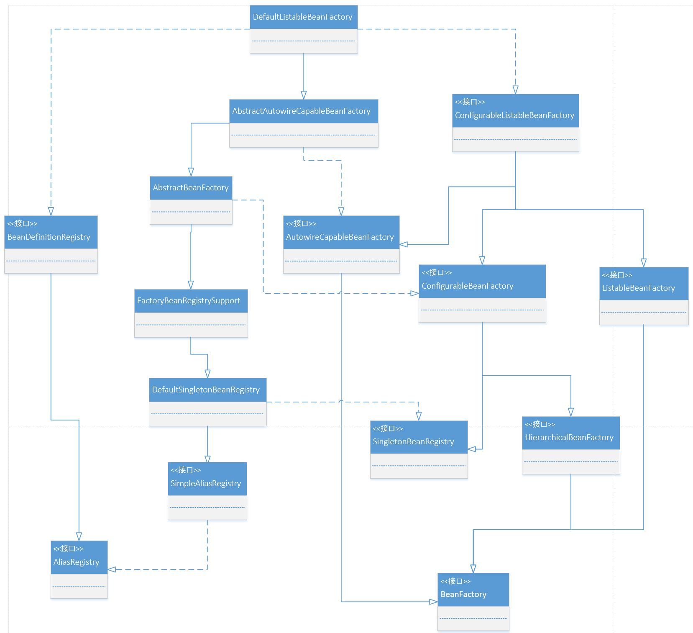

# BeanFactory
--
spring的核心是ICO，ICO的核心是容器，容器的基础是BeanFactory
### 一 DefaultListableBeanFactory


- AliasRegistry : 定义对Alias简单的增删改查操作
    ```java
    public interface AliasRegistry {  
        /**
         * Given a name, register an alias for it.
         */
        void registerAlias(String name, String alias);  
        /**
         * Remove the specified alias from this registry.
         */
        void removeAlias(String alias);  
        /**
         * Determine whether this given name is defines as an alias
         * (as opposed to the name of an actually registered component).
         */
        boolean isAlias(String name);  
        /**
         * Return the aliases for the given name, if defined.
         */
        String[] getAliases(String name);  
    }
    ```

- SimpleAliasRegistry : 以map作为alias的缓存，并对AliasRegistry进行实现
    ```java
    public class SimpleAliasRegistry implements AliasRegistry {  
        /** Map from alias to canonical name. */
        private final Map<String, String> aliasMap = new ConcurrentHashMap<>(16);  
    }
    ```
- SingletonBeanRegistry : 定义对Singleton的注册及获取
    ```java
    public interface SingletonBeanRegistry {  
        /**
         * Register the given existing object as singleton in the bean registry,
         * under the given bean name.
          */
        void registerSingleton(String beanName, Object singletonObject);  
        /**
         * Return the (raw) singleton object registered under the given name.
         */
        @Nullable
        Object getSingleton(String beanName);  
        /**
         * Check if this registry contains a singleton instance with the given name.
         */
        boolean containsSingleton(String beanName);  
        /**
         * Return the names of singleton beans registered in this registry.
         */
        String[] getSingletonNames();  
        /**
         * Return the number of singleton beans registered in this registry.
         */
        int getSingletonCount();  
        /**
         * Return the singleton mutex used by this registry (for external collaborators).
         */
        Object getSingletonMutex();  
    }
    ```    
- DefaultSingletonBeanRegistry : 继承SimpleAliasRegistry并对SingletonBeanRegistry进行实现
    ```java
    public class DefaultSingletonBeanRegistry extends SimpleAliasRegistry implements SingletonBeanRegistry {  
        /** Cache of singleton objects: bean name to bean instance. */
        private final Map<String, Object> singletonObjects = new ConcurrentHashMap<>(256);  
        /** Cache of singleton factories: bean name to ObjectFactory. */
        private final Map<String, ObjectFactory<?>> singletonFactories = new HashMap<>(16);  
        /** Cache of early singleton objects: bean name to bean instance. */
        private final Map<String, Object> earlySingletonObjects = new HashMap<>(16);  
        /** Set of registered singletons, containing the bean names in registration order. */
        private final Set<String> registeredSingletons = new LinkedHashSet<>(256);  
        /** Names of beans that are currently in creation. */
        private final Set<String> singletonsCurrentlyInCreation =
                Collections.newSetFromMap(new ConcurrentHashMap<>(16));  
        /** Names of beans currently excluded from in creation checks. */
        private final Set<String> inCreationCheckExclusions =
                Collections.newSetFromMap(new ConcurrentHashMap<>(16));  
        /** List of suppressed Exceptions, available for associating related causes. */
        @Nullable
        private Set<Exception> suppressedExceptions;  
        /** Flag that indicates whether we're currently within destroySingletons. */
        private boolean singletonsCurrentlyInDestruction = false;  
        /** Disposable bean instances: bean name to disposable instance. */
        private final Map<String, Object> disposableBeans = new LinkedHashMap<>();  
        /** Map between containing bean names: bean name to Set of bean names that the bean contains. */
        private final Map<String, Set<String>> containedBeanMap = new ConcurrentHashMap<>(16);  
        /** Map between dependent bean names: bean name to Set of dependent bean names. */
        private final Map<String, Set<String>> dependentBeanMap = new ConcurrentHashMap<>(64);  
        /** Map between depending bean names: bean name to Set of bean names for the bean's dependencies. */
        private final Map<String, Set<String>> dependenciesForBeanMap = new ConcurrentHashMap<>(64);  
    }
    ```    
- FactoryBeanRegistrySupport : 在DefaultSingletonBeanRegistry的基础上增加了对FactoryBean的特殊处理 
    ```java
    /**
     * Support base class for singleton registries which need to handle
     * {@link org.springframework.beans.factory.FactoryBean} instances,
     * integrated with {@link DefaultSingletonBeanRegistry}'s singleton management.
     */
    public abstract class FactoryBeanRegistrySupport extends DefaultSingletonBeanRegistry {}
    ``` 
   
### 二 XMLBeanFactory
```java
public class BeanFactoryTest {

    @Test
    public void testSimpleLoad() {
        BeanFactory beanFactory = new XmlBeanFactory(new ClassPathResource("beanFactory.xml"));
        CustomBean customBean = (CustomBean) beanFactory.getBean("customBean");
    }
}
```
XmlBeanFactory在Spring 3.1版本弃用
```java
 /* @see org.springframework.beans.factory.support.DefaultListableBeanFactory
  * @see XmlBeanDefinitionReader
  * @deprecated as of Spring 3.1 in favor of {@link DefaultListableBeanFactory} and
  * {@link XmlBeanDefinitionReader}
  */
 @Deprecated
 @SuppressWarnings({"serial", "all"})
 public class XmlBeanFactory extends DefaultListableBeanFactory {
     
 }
```

### 三 ApplicationContext

```java
public class BeanFactoryTest {

    @Test
    public void testSimpleLoad() {
        ApplicationContext context = new ClassPathXmlApplicationContext("beanFactory.xml");
        CustomBean customBean = (CustomBean) context.getBean("customBean");
    }
}
```