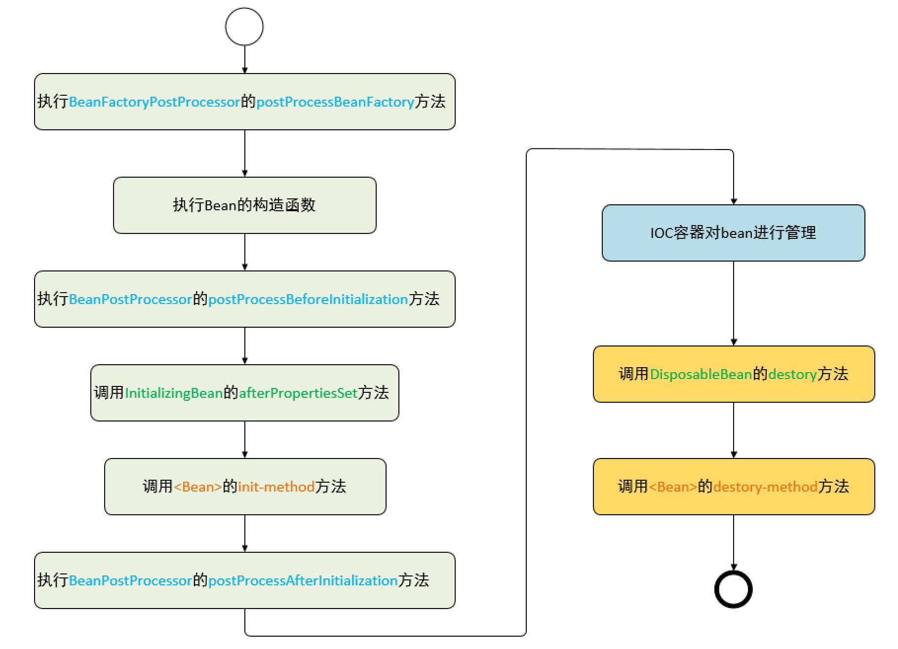

## Life Cycle Of Bean
---
Bean的完整生命周期从创建Spring容器开始，直到Spring容器销毁Bean，这其中包含了如下图所示关键节点


### 一 BeanFactoryPostProcessor
Spring的IoC容器允许BeanFactoryPostProcessor在容器实例化任何其它的bean之前读取配置元数据，并有可能修改它。
[自定义Bean的Scope](/markdown/spring/beanScope.md)就是基于BeanFactoryPostProcessor实现
### 二 BeanPostProcessor

实现BeanPostProcessor接口可以在Bean初始化的前后做一些自定义的操作，但是拿到的参数只有BeanDefinition实例和BeanDefinition的名称，也就是无法修改BeanDefinition元数据,这里说的Bean的初始化是：

- (1)bean实现了InitializingBean接口，对应的方法为afterPropertiesSet

- (2)在bean定义的时候，通过init-method设置的方法


Spring的createBean创建bean分为两段执行逻辑
```java
@Override
protected Object createBean(String beanName, RootBeanDefinition mbd, @Nullable Object[] args) throws BeanCreationException {
    ...
	try {
        // (1)Give BeanPostProcessors a chance to return a proxy instead of the target bean instance.
		Object bean = resolveBeforeInstantiation(beanName, mbdToUse);
		if (bean != null) {
		    return bean;
		}
    } catch (Throwable ex) {
        throw new BeanCreationException(mbdToUse.getResourceDescription(), beanName,
					"BeanPostProcessor before instantiation of bean failed", ex);
    }

    try {
        // (2) 执行普通初始化逻辑
        Object beanInstance = doCreateBean(beanName, mbdToUse, args);
        if (logger.isTraceEnabled()) {
            logger.trace("Finished creating instance of bean '" + beanName + "'");}
            return beanInstance;
		} catch (BeanCreationException | ImplicitlyAppearedSingletonException ex) {
			// A previously detected exception with proper bean creation context already,
			// or illegal singleton state to be communicated up to DefaultSingletonBeanRegistry.
			throw ex;
		}
	}
```
#### 2.1 Spring AOP 基于BeanPostProcessor实现
```java
	protected Object resolveBeforeInstantiation(String beanName, RootBeanDefinition mbd) {
		Object bean = null;
		if (!Boolean.FALSE.equals(mbd.beforeInstantiationResolved)) {
			// Make sure bean class is actually resolved at this point.
			if (!mbd.isSynthetic() && hasInstantiationAwareBeanPostProcessors()) {
				Class<?> targetType = determineTargetType(beanName, mbd);
				if (targetType != null) {
					bean = applyBeanPostProcessorsBeforeInstantiation(targetType, beanName);
					if (bean != null) {
						bean = applyBeanPostProcessorsAfterInitialization(bean, beanName);
					}
				}
			}
			mbd.beforeInstantiationResolved = (bean != null);
		}
		return bean;
	}
	
	protected Object applyBeanPostProcessorsBeforeInstantiation(Class<?> beanClass, String beanName) {
		for (BeanPostProcessor bp : getBeanPostProcessors()) {
			if (bp instanceof InstantiationAwareBeanPostProcessor) {
				InstantiationAwareBeanPostProcessor ibp = (InstantiationAwareBeanPostProcessor) bp;
				Object result = ibp.postProcessBeforeInstantiation(beanClass, beanName);
				if (result != null) {
					return result;
				}
			}
		}
		return null;
	}
	
	
	@Override
	public Object applyBeanPostProcessorsAfterInitialization(Object existingBean, String beanName)
			throws BeansException {

		Object result = existingBean;
		for (BeanPostProcessor processor : getBeanPostProcessors()) {
			Object current = processor.postProcessAfterInitialization(result, beanName);
			if (current == null) {
				return result;
			}
			result = current;
		}
		return result;
	}	
	
	/**
	 * Return the list of BeanPostProcessors that will get applied
	 * to beans created with this factory.
	 */
	public List<BeanPostProcessor> getBeanPostProcessors() {
		return this.beanPostProcessors;
	}	
	
```
如上代码applyBeanPostProcessorsBeforeInstantiation方法和applyBeanPostProcessorsAfterInitialization方法
分别实现了对注册的BeanPostProcessor调用，AOP的核心类AbstractAutoProxyCreator实现了BeanPostProcessor接口，它实现了
postProcessBeforeInstantiation方法，使得AOP生成的代理类会被实例化
```java
@Override
	public Object postProcessBeforeInstantiation(Class<?> beanClass, String beanName) {
		Object cacheKey = getCacheKey(beanClass, beanName);

		if (!StringUtils.hasLength(beanName) || !this.targetSourcedBeans.contains(beanName)) {
			if (this.advisedBeans.containsKey(cacheKey)) {
				return null;
			}
			if (isInfrastructureClass(beanClass) || shouldSkip(beanClass, beanName)) {
				this.advisedBeans.put(cacheKey, Boolean.FALSE);
				return null;
			}
		}

		// Create proxy here if we have a custom TargetSource.
		// Suppresses unnecessary default instantiation of the target bean:
		// The TargetSource will handle target instances in a custom fashion.
		TargetSource targetSource = getCustomTargetSource(beanClass, beanName);
		if (targetSource != null) {
			if (StringUtils.hasLength(beanName)) {
				this.targetSourcedBeans.add(beanName);
			}
			Object[] specificInterceptors = getAdvicesAndAdvisorsForBean(beanClass, beanName, targetSource);
			Object proxy = createProxy(beanClass, beanName, specificInterceptors, targetSource);
			this.proxyTypes.put(cacheKey, proxy.getClass());
			return proxy;
		}

		return null;
	}
```
### 2.2 进行常规的bean创建doCreateBean
[常规的bean创建doCreateBean](/markdown/spring/bean的加载前篇.md)
### 三 InitializationBean、init-method、DisposableBean、destroy-method

如下代码在调用自定义初始化方法之前会先调用InitializationBean的afterPropertiesSet方法
```java
	protected void invokeInitMethods(String beanName, final Object bean, @Nullable RootBeanDefinition mbd)
			throws Throwable {

		boolean isInitializingBean = (bean instanceof InitializingBean);
		if (isInitializingBean && (mbd == null || !mbd.isExternallyManagedInitMethod("afterPropertiesSet"))) {
			if (logger.isTraceEnabled()) {
				logger.trace("Invoking afterPropertiesSet() on bean with name '" + beanName + "'");
			}
			if (System.getSecurityManager() != null) {
				try {
					AccessController.doPrivileged((PrivilegedExceptionAction<Object>) () -> {
						((InitializingBean) bean).afterPropertiesSet();
						return null;
					}, getAccessControlContext());
				}
				catch (PrivilegedActionException pae) {
					throw pae.getException();
				}
			}
			else {
				((InitializingBean) bean).afterPropertiesSet();
			}
		}

		if (mbd != null && bean.getClass() != NullBean.class) {
			String initMethodName = mbd.getInitMethodName();
			if (StringUtils.hasLength(initMethodName) &&
					!(isInitializingBean && "afterPropertiesSet".equals(initMethodName)) &&
					!mbd.isExternallyManagedInitMethod(initMethodName)) {
				invokeCustomInitMethod(beanName, bean, mbd);
			}
		}
	}
```
DisposableBean、destroy-method同理不再赘述，

### 四 自定义实现
```java
public class BeanDemo implements InitializingBean, DisposableBean, BeanPostProcessor, BeanFactoryPostProcessor {
    
    // 实现InitializingBean方法
    @Override
    public void afterPropertiesSet() throws Exception {

    }
    // 实现DisposableBean方法
    @Override
    public void destroy() throws Exception {

    }
    // 实现BeanPostProcessor方法
    @Override
    public Object postProcessBeforeInitialization(Object bean, String beanName) throws BeansException {
        return null;
    }
    // 实现BeanPostProcessor方法
    @Override
    public Object postProcessAfterInitialization(Object bean, String beanName) throws BeansException {
        return null;
    }
    // BeanFactoryPostProcessor
    @Override
    public void postProcessBeanFactory(ConfigurableListableBeanFactory configurableListableBeanFactory) throws BeansException {

    }
}
```

