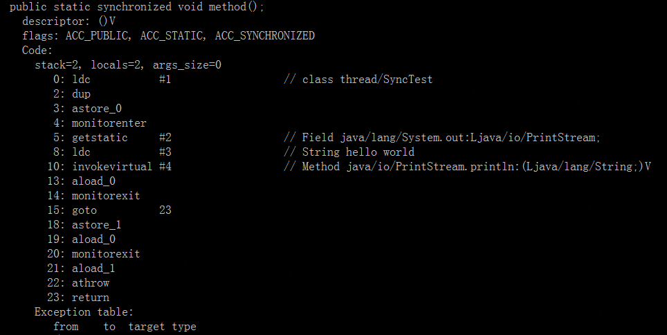

# synchronized
---
## 一 synchronized使用
### 1.1 修饰普通方法
    public synchronized void method() {
        // do something
    }
    
### 1.2 synchronized 代码块
synchronized 代码块是对实例对象加锁

    synchronized (this) {
        // do something
    }      
### 1.3 修饰静态方法(类)  
对静态方法的同步本质上是对类的同步（静态方法本质上是属于类的方法，而不是对象上的方法）,对类对象加锁

    public static synchronized void method() {
        // do something
    }  
    
    synchronized (SyncTest.class) {
        // do something
    }      

## 二 synchronized实现原理

    public static synchronized void method() {
        synchronized (SyncTest.class) {
            System.out.println("hello world");
        }
    }
使用 javap -v class SyncTest.class 反编译结果如下图

执行同步代码首先要先执行monitorenter指令，退出时执行monitorexit指令。使用Synchronized进行同步，其关键就是对对象监视器monitor进行获取，
当线程获取monitor后才能继续往下执行，否则就只能等待。执行一次monitorenter两次monitorexit是由于锁的重入性，即在同一锁程中，线程不需要再次获取同一把锁。
Synchronized先天具有重入性。每个对象拥有一个计数器，当线程获取该对象锁后，计数器就会加一，释放锁后就会将计数器减一。
